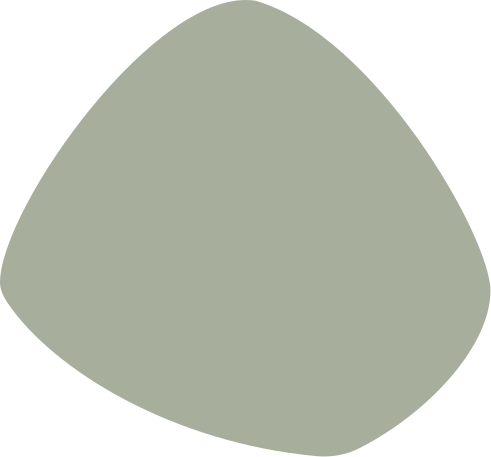

# Besy · psí salon – projektový brief

Tento soubor vlož na začátek nového chatu (nebo nech AI přečíst `BRIEF.md`), aby věděla, co je tohle za projekt a jak se v něm pracuje.

## 1. Co to je

Landing page (jedna stránka, žádné podstránky) pro psí salon **Besy** v&nbsp;Chrudimi. Salon vede **Marie Kasanová** – je na&nbsp;to sama, psy upravuje od&nbsp;svých 17&nbsp;let, celkem 33&nbsp;let. Nabízí stříhání, koupání, trimování a&nbsp;výstavní úpravy. **Pevnou otevírací dobu nemá**, všechno jede na&nbsp;domluvený termín. Obsah je poskládaný podle konverzního flow *jsem na správném místě → tobě můžu psa nechat → takhle to umím → tohle to stojí → takhle se to objedná → někdo tam byl a byl rád → pochybnosti vyřešeny → volám*. **Objednává se výhradně telefonicky** – žádný formulář, žádný WhatsApp; každé hlavní CTA je `tel:` odkaz. Vizuálně je to replika stylu homepage upperhound.co.uk: organické „blob“ tvary kolem fotek (skutečné SVG ze složky `Blobs/`), vlnité přechody mezi sekcemi, ručně kreslené akcenty (zelené srdíčko, kolečka, žluté čárky), měkký serif v nadpisech, olivová/šalvějová/krémová/žlutá paleta. Texty jsou české a vlastní, logo je textové, fotky stock z Unsplash.

## 2. Stack a soubory

Čisté HTML + CSS + JS, bez buildu, bez frameworků. Jediná knihovna je Leaflet (mapa, uložený lokálně v&nbsp;`js/vendor/` a&nbsp;`css/vendor/`) – Leaflet přibyl se&nbsp;souhlasem uživatele kvůli markeru s&nbsp;logem, viz sekce&nbsp;9.

```
Salon/
  index.html            celá stránka + inline SVG (ikony, vlna)
  404.html              chybová stránka; GitHub Pages ji servíruje na každé neexistující
                        adrese, takže relativní cesty tu nejdou. css/styles.css se
                        načítá od kořene (BASE v <head>, document.write), vlastní
                        <style> má jen plakát „Hledá se“ s trhacími lístky (tel:,
                        pro čtečky jen první). Lišta, patička a ikony jsou DOSLOVNÉ
                        KOPIE z index.html – při jejich změně přepsat i tady. Liší se
                        jen odkazy (data-home="#sekce", skript předřadí BASE), logo
                        je vložené SVG a služby vedou na ?sluzba=N#sluzby, což na
                        úvodu přepne záložku (main.js, hned za syncTabsMode).
                        main.js se na 404 nenačítá; lištu obsluhuje inline skript
                        (is-scrolled, hamburger, Esc, aria-expanded). .callbar tu není
  Blobs/                zdrojové SVG organických tvarů – maska fotky, tvar za ní,
                        tvary do sekcí, akcenty, hotové skupiny; NEEDITOVAT
  css/styles.css        tokeny, reset, komponenty, sekce, responsivita
  js/main.js            menu, záložky služeb, rozbalení recenzí, lightbox galerie,
                        scroll-reveal, sticky nav, mobilní lišta, mapa
  fonts/                Baloo 2 a Karla (woff2, subsety latin + latin-ext) a jejich
                        licence OFL; @font-face je na začátku css/styles.css
  js/vendor/            Leaflet 1.9.4 (mapa) – jediná knihovna v projektu, uložená
  css/vendor/           lokálně, ne z CDN; needitovat, při aktualizaci přepsat celé
  images/demo/          DOČASNÉ cizí fotky před/po (maketa) – před spuštěním smazat,
                        viz images/demo/PUVOD.txt
  images/logo-*.svg     značka (silueta pudla): logo-black.svg v liště, logo-white.svg
                        v patičce a v markeru mapy
  favicon.ico, favicon.svg, apple-touch-icon.png, icon-192.png, icon-512.png
                        ikony webu, leží v kořeni; icon-* nese i site.webmanifest
  BRIEF.md              tento soubor (nepublikuje se, viz _config.yml)
  _config.yml           GitHub Pages: vyloučí BRIEF.md a CLAUDE.md z webu. Nahradil
                        .nojekyll – bez Jekyllu by se publikovalo úplně všechno.
                        HTML/CSS/JS nemají front matter, takže je Jekyll jen kopíruje
  .gitignore            .playwright-mcp/ (logy a screenshoty z testování)
```

Skutečné fotky salonu patří do `images/` (ne do `images/demo/`). Stock fotky psů se pořád tahají z&nbsp;Unsplash přes URL – nahradí se, až budou vlastní.

Spuštění: otevřít `index.html` v prohlížeči, nebo v adresáři `Salon` spustit `python -m http.server 8765` a otevřít http://127.0.0.1:8765/.

## 3. Design tokeny (CSS proměnné v `:root`)

| Token | Hodnota | Použití |
|---|---|---|
| `--primary-100` | `#e7ecdb` | pozadí hero (šalvějová) |
| `--primary-200` | `#d0dbbb` | světlé plochy, placeholder mapy |
| `--primary-500` | `#6d854a` | akcent v&nbsp;nadpisech (`h1 em`), zelené tvary v&nbsp;`Blobs/`, marker mapy |
| `--primary-600` | `#5c733d` | **plocha tlačítek**, číslo kroku, štítek „Po“ – všude, kde je bílý text na&nbsp;zelené |
| `--primary-700` | `#485932` | outline tlačítka, hover plných tlačítek, `.eyebrow` |
| `--logo-ink` | `#111111` | nápis „Besy“ v&nbsp;liště – stejná černá jako silueta v&nbsp;`images/logo-black.svg`; při změně barvy značky přepsat obojí. V&nbsp;patičce je nápis krémový (`.logo--light`) |
| `--cream` | `#fff9f1` | krémové pozadí sekcí |
| `--orange` | `#f6ae2d` | hvězdy, žluté akcenty v `Blobs/`, aktivní záložka |
| `--peru` | `#bd9058` | podtitul loga |
| `--dark` | `#3a3c36` | nadpisy, footer |
| `--grey` | `#545b4b` | podtitul v&nbsp;hero, ikony kontaktu |
| `--text-2` / `--text-3` | `#3b3b3b` / `#555555` | běžný / sekundární text |
| `--radius-btn` | `2.5rem` | pilulková tlačítka |
| `--radius-card` | `1rem` | karty |
| `--shadow`, `--shadow-lg` | jemné olivové stíny | karty, hover |
| `--section-pad` | `clamp(3.5rem, 7vw, 6rem)` | vertikální padding sekcí |
| `--wave-h` | `clamp(36px, 4.8vw, 72px)` | výška vlny |
| `--container` | `clamp(85rem, 53.125rem + 35.4vw, 120rem)` | max. šířka obsahu; kopíruje upperhound.co.uk – do&nbsp;1440&nbsp;px se neuplatní (řídí `--gutter`), nad ním roste s&nbsp;oknem (1360&nbsp;px @1440, 1530&nbsp;px @1920) |
| `--gutter` | `2.5rem` (pod 600&nbsp;px `1.25rem`) | boční okraj stránky |

**Fonty:** nadpisy a logo `Baloo 2` (nadpisy weight 700, `.logo__name` 600, drobnější prvky 400/500), text `Karla` (400/500/600). **Jsou uložená u&nbsp;webu ve&nbsp;složce `fonts/`, ne načítaná z&nbsp;Google Fonts** (10/2026) – návštěvník tak neposílá svou IP adresu Googlu a&nbsp;web, který tvrdí, že nemá cookies ani měření, nemá ani tenhle přenos. `@font-face` je na začátku `css/styles.css`, obě písma jsou variabilní (jeden soubor na subset pokryje všechny řezy), každé má subset latin a&nbsp;latin-ext; `unicode-range` zařídí, že se latin-ext stáhne jen kvůli znakům jako č, ř, ě. V&nbsp;`<head>` je `preload` jen pro oba soubory latin. `404.html` skládá stejné `@font-face` v&nbsp;inline skriptu od&nbsp;kořene webu (proměnná `BASE`), protože relativní cesta by se na hlubší adrese rozbila. Nové písmo nebo řez: stáhnout woff2 ze stejného CSS, které by vydal Google Fonts, a&nbsp;doplnit na&nbsp;obě místa. V `:root` jsou pod `--font-display` a `--font-body` – názvy popisují roli, ne tvar písma, protože obě jsou bezpatková. Nepoužívat Inter, Roboto, Arial.

**Pozor na kurzivu.** `Baloo 2` kurzivu nemá. Zvýrazněné slovo v&nbsp;nadpisu (`h1 em`) se proto odlišuje **jen zelenou barvou** a má explicitní `font-style: normal` – bez toho by ho prohlížeč zkosil sám, protože `<em>` je ve&nbsp;výchozím stavu kurzivou. Totéž platí pro `.logo__name`. Kdyby se na&nbsp;písma sahalo znovu, kandidát bez skutečné kurzivy tuhle výjimku potřebuje taky.

**Zelené slovo v&nbsp;nadpisu jen na&nbsp;čtyřech místech: hero, Před a&nbsp;po, Kontakt a&nbsp;závěrečné CTA.** Dřív ho měly všechny nadpisy sekcí (8× stejný vzorec „slovo + zelené slovo“) a&nbsp;stránka tím působila šablonovitě. Ostatní nadpisy (`#o-nas`, vitrína ocenění, `#sluzby`, `#jak-to-probiha`, `#recenze`, `#dotazy`) jsou celé tmavé. Nové nadpisy zelené slovo nedostávají; když už, tak místo jednoho z&nbsp;těch čtyř, ne navíc.

**Řádkování nadpisů je 1.18, ne míň.** `Baloo 2` má vysoké svislé metriky (font box 1,6&nbsp;em, inkoust s&nbsp;českou diakritikou 1,06&nbsp;em). Pod 1.15 se u&nbsp;dvouřádkových nadpisů začne háček na&nbsp;druhém řádku dotýkat dotažnice z&nbsp;prvního. Nadpisy taky nemají záporný `letter-spacing` – kulaté tučné písmo ho nepotřebuje.

**Pozadí a přechody sekcí v pořadí.** Stránka má jen dvě barvy pozadí: **krémovou jako základ** a **šalvějovou jako rytmus** (3× – hero, jak to probíhá, kontakt). Bílá už není pozadím žádné sekce, zůstala jen pro karty. Vlna je vždycky tam, kde se barva mění; kde na sebe navazují dvě krémové sekce, je tvrdá hrana. **U tvrdé hrany dělá mezeru jen spodní padding horní sekce, spodní sekce má `padding-top: 0`** (`.services`, `.gallery`, `.faq`). Dřív se oba paddingy sčítaly a mezi službami a galerií i mezi recenzemi a dotazy byla díra ~200&nbsp;px proti 96&nbsp;px jinde. Nadpis těchhle sekcí proto sedí hned u horní hrany a kotva z&nbsp;menu by ho přilepila k&nbsp;liště – `#sluzby, #galerie, #dotazy` mají vyšší `scroll-margin-top` (o&nbsp;2,5&nbsp;rem). Pozor na&nbsp;horní `margin` prvního potomka: bez paddingu proteče ven ze sekce (proto `.gallery__head h2 + p`, ne `.gallery__head p` – `.eyebrow` je taky `<p>`).

| Sekce | Pozadí | Přechod dolů |
|---|---|---|
| hero | `--primary-100` | vlna → `--cream` |
| o-nas | `--cream` | tvrdá hrana |
| sluzby | `--cream` | tvrdá hrana |
| galerie | `--cream` | vlna → `--primary-100` |
| jak-to-probiha | `--primary-100` | vlna--flip → `--cream` |
| recenze | `--cream` | tvrdá hrana |
| dotazy | `--cream` | vlna → `--primary-100` |
| kontakt | `--primary-100` | vlna--flip → `--cream` |
| objednat (CTA) | `--cream` | vlna--flip → `--dark` (poslední prvek `<main>`) |
| footer | `--dark` | – |

**Barvy prošly kontrastní kontrolou, neposvětlovat je.** `--grey`, `--text-3`, plocha plných tlačítek a `.eyebrow` mají hodnoty vybrané tak, aby text splnil WCAG&nbsp;AA (běžný text 4,5:1, velký a&nbsp;tučný 3:1). Konkrétně: `--grey` byl `#7a816f` (3,35:1 na&nbsp;šalvějové – nejhorší nález na&nbsp;stránce), `--text-3` byl `#757575` (4,25:1), `.btn--primary` stálo na&nbsp;`--primary-500` (4,11:1) a&nbsp;`.eyebrow` na&nbsp;`--primary-600` (4,38:1). V&nbsp;10/2026 šly `--grey` a&nbsp;`--text-3` ještě o&nbsp;stupeň níž (z&nbsp;`#646b5b` / `#6b6b6b`), protože AA s&nbsp;rezervou 0,1 nestačí na&nbsp;drobný text na&nbsp;mobilu na&nbsp;slunci: teď má `--grey` 5,86:1 na&nbsp;šalvějové a&nbsp;6,75:1 na&nbsp;krémové, `--text-3` 7,13:1 na&nbsp;krémové. Současně se zvětšil drobný text – **spodní hranice pro cokoli, co se čte (ceny, jména, poznámky, právní řádek), je `.875rem` = 14&nbsp;px**; menší jsou jen štítky v&nbsp;pilulkách (Specialita, Před/Po, plemeno). Nezmenšovat zpátky. Když se některá barva bude měnit, přeměřit – nejmenší rezervu má teď `--grey` na&nbsp;šalvějovém pozadí (5,86:1). `.btn--primary` musí přepisovat i&nbsp;`border-color`, protože `.btn` ho má na&nbsp;`--primary-500` a&nbsp;kolem tmavší plochy by zůstal světlejší prstenec. Jediná výjimka jsou písmena loga Google u&nbsp;recenzí (žluté „o“ má 1,63:1) – logotypy jsou z&nbsp;WCAG vyňaté a&nbsp;přebarvit logo Google jeho podmínky zakazují.

**Web je jen světlý a prohlížeč ho nesmí přebarvit.** V&nbsp;`<head>` obou stránek je `<meta name="color-scheme" content="only light">` a&nbsp;v&nbsp;`:root` totéž jako `color-scheme: only light`. Bez toho Samsung Internet a&nbsp;Chrome s&nbsp;volbou tmavých webů stránku na tmavém telefonu samy přebarví: pozadí ztmavne, ale krémové vlny (barva přes `currentColor`) zůstanou světlé, šipky v&nbsp;FAQ skoro zmizí a&nbsp;obrysová tlačítka vyblednou (ověřeno 10/2026 v&nbsp;Chromiu s&nbsp;`WebContentsForceDark`). **Neodstraňovat.** Vlastní tmavý motiv web nemá a&nbsp;nemá mít – krémová patří ke&nbsp;značce.

**Bílá je jen barva karet, ne sekcí** – `.panel`, `.review`, `.pair`, `.tab`. Kdyby některá sekce dostala zpátky `#fff`, karty na ní zmizí. Ze stejného důvodu má `.panel` (bílá karta na krémové sekci) uvnitř cenový box `.panel__prices` ve `--primary-50`, ne v bílé.

## 4. Struktura stránky (id sekcí a hlavní třídy)

0. `<head>` – title s městem, description, canonical, OG. Dva `application/ld+json`: **LocalBusiness** (adresa, telefon, `openingHoursSpecification`, `priceRange`, `geo`, `sameAs`) a **FAQPage**. LocalBusiness je **záměrně bez `aggregateRating`** – Google zakazuje označovat vlastní recenze na vlastním webu a umí za to udělit manuální penalizaci. Seznam všech placeholderů je v&nbsp;sekci&nbsp;8 tohohle souboru (dřív HTML komentář pod `<body>`, odstraněný, protože byl veřejně vidět ve&nbsp;zdrojovém kódu).
1. `header.nav#nav` – sticky, po scrollu dostane `.is-scrolled`; pod 1200&nbsp;px hamburger `#nav-toggle` a menu `#nav-menu`. Menu kopíruje pořadí sekcí na stránce: **O&nbsp;mně · Služby a&nbsp;ceník ▾ · Galerie · Jak to&nbsp;probíhá · Recenze · Dotazy · Kontakt**, takže každá sekce `<main>` má svůj odkaz (`#objednat` pokrývá telefonní CTA). **CTA je viditelné telefonní číslo jako `tel:` odkaz**, ne tlačítko „Objednat se“.

   **Rozbalovací nabídka služeb – pozor na můstek.** Karta `.nav__drop` je široká
   22&nbsp;rem a&nbsp;centrovaná na&nbsp;spouštěč, takže sahá pod sousední odkazy.
   Neviditelný můstek, který drží hover cestou od&nbsp;spouštěče dolů, proto **nesmí
   viset na&nbsp;kartě** – tam by při otevřené nabídce překryl „Galerie“ a&nbsp;ten by
   nešlo kliknout. Visí na&nbsp;`.nav__group::after` a&nbsp;je široký jen jako
   spouštěč (`left/right: -1rem`, mezera mezi odkazy je 2,25&nbsp;rem, takže se
   nedotknou). Výšku můstku i&nbsp;odsazení karty řídí jedna proměnná
   `--drop-gap: 1.75rem` – **musí zůstat stejné**, jinak hover propadne do&nbsp;prázdna.
   Hodnota je vyladěná tak, aby karta začínala těsně pod spodní hranou lišty
   (spouštěč je flex položka vysoká jen na&nbsp;řádek textu, takže `top: 100%` končí
   uprostřed lišty). Pod&nbsp;1200&nbsp;px je podseznam statický a&nbsp;můstek vypnutý
   (`content: none`).

   **Podseznam má jediná položka – Služby a&nbsp;ceník** (`span.nav__group` > `a.nav__group-btn` + `span.nav__drop`). Je to záměr, ne začátek stromu: služby jsou jediný obsah stránky schovaný ve&nbsp;výchozím stavu – v&nbsp;ceníku vidí návštěvník 1&nbsp;z&nbsp;5&nbsp;panelů, dokud neklikne, takže z&nbsp;listy jinak nepozná, že se tu třeba trimuje. Ostatní sekce se najdou scrollem a&nbsp;rozbalovátko by je jen schovalo. **Spouštěč zůstává skutečný `<a href="#sluzby">`**, aby bez&nbsp;JS pořád scrolloval na&nbsp;sekci; položky uvnitř nesou `data-tab` a&nbsp;přepnou záložku – obsluhuje je týž obecný handler `a[data-tab]` v&nbsp;`main.js`, který už dřív sloužil odkazu u&nbsp;pohárů a&nbsp;který nově obsluhuje i&nbsp;sloupec Služby v&nbsp;patičce (předtím všech pět odkazů mířilo na&nbsp;holé `#sluzby` a&nbsp;žádný z&nbsp;nich záložku nepřepínal). **Ceny v&nbsp;nabídce jsou opsané z&nbsp;`.tab__price` – při změně ceníku přepsat obě místa.** Na&nbsp;myši a&nbsp;klávesnici otevírá nabídku samo CSS (`:hover` / `:focus-within`), `main.js` řeší jen Esc a&nbsp;první ťuk na&nbsp;dotykovém displeji, kde by jinak první dotek rovnou odscrolloval na&nbsp;sekci a&nbsp;podseznam by nikdo neviděl. Karta je **bílá jako ostatní karty** – krémová by se po&nbsp;odscrollování slila s&nbsp;listou i&nbsp;s&nbsp;pozadím sekce pod&nbsp;ní.

   **Escape a&nbsp;`aria-expanded` mají vlastní obsluhu, protože nabídku otevírá CSS.** Z&nbsp;toho plynou dvě pasti a&nbsp;obě jsou už ošetřené – neodstraňovat je:
   - `aria-expanded` se **dopočítává ze skutečného stavu** (funkce `isGroupVisible()` / `syncGroupAria()` v&nbsp;`main.js`), ne z&nbsp;toho, co nastavil JS. Dřív hlásilo `false` i&nbsp;nad&nbsp;viditelně otevřenou nabídkou, protože ji otevřel `:hover` nebo `:focus-within` a&nbsp;JS o&nbsp;tom nevěděl. Pod&nbsp;1200&nbsp;px se atribut **sundává úplně** – v&nbsp;hamburgeru je podseznam rozbalený natrvalo a&nbsp;„vždy otevřeno“ není stav, který by se měl hlásit.
   - Escape sundá `.is-open`, jenže fokus se vrací na&nbsp;spouštěč **uvnitř** `.nav__group`, takže `:focus-within` nabídku držel otevřenou dál a&nbsp;Escape nedělal nic viditelného. Řeší to třída **`.is-dismissed`** (CSS pravidlo hned pod&nbsp;trojicí `:hover / :focus-within / .is-open`, stejná specificita 0‑3‑0, proto musí zůstat **pod&nbsp;nimi**). Zapomene se, jakmile kurzor i&nbsp;fokus ze skupiny odejdou, aby šla nabídka příště normálně otevřít.

   **Váha lišty.** Odkazy mají `1.05rem`/600, ne `.95rem`/500. Lišta je vysoká 5&nbsp;rem a&nbsp;logo v&nbsp;ní má 1,85&nbsp;rem – s&nbsp;drobnějšími odkazy zabíral text jen 31&nbsp;% výšky lišty a&nbsp;četl jako popisky, ne jako navigace (po&nbsp;zvětšení 55&nbsp;%). **Lištu proto nezvyšuj** – víc výšky ten poměr jen zhorší, zvětšovat se musí obsah. Ze&nbsp;stejného důvodu má `.nav__cta` vlastní `padding`/`font-size` místo holého `.btn--sm`, které dělalo pilulku přesně v&nbsp;půlce výšky lišty.

   **Stavy.** Odkazy jsou pilulky (`--radius-btn`): hover `--primary-50`, aktivní sekce `--primary-100` + `--primary-700`. **Hover musí zůstat o&nbsp;stupeň jemnější než aktivní stav** – kdyby byly stejné, pod&nbsp;kurzorem by se ztratila informace, kde návštěvník je. Nad&nbsp;herem má lišta stejné pozadí jako sekce, takže by v&nbsp;ní šalvějová pilulka zmizela; `.nav:not(.is-scrolled)` proto kreslí aktivní stav v&nbsp;`--primary-200`. Mezery mezi odkazy nese **padding pilulek, ne `gap`** – jinak by se pilulky dotýkaly; při změně paddingu dorovnej i&nbsp;`gap`.

   **Aktivní sekci hlídá `IntersectionObserver`** v&nbsp;`main.js` (sekce „zvýraznění sekce“). Sleduje se úzký pás uprostřed okna (`rootMargin: -45% 0px -50% 0px`), ne celá sekce – při dvou sekcích na&nbsp;obrazovce je tak aktivní právě jedna. `#hero` se sleduje taky, aby po&nbsp;návratu nahoru pilulka zhasla; **`#objednat` se schválně nesleduje**, tam má zůstat svítit Kontakt. Aktivní odkaz dostane `.is-current` i&nbsp;`aria-current="true"`.

   **Otevřené menu potřebuje tři výjimky** (všechny se specificitou 0,2,0, aby přebily `.nav.is-scrolled`), jinak je hamburger na&nbsp;odscrollované stránce nepoužitelný: `backdrop-filter` dělá z&nbsp;lišty containing block pro `position: fixed`, takže by se vysunutý panel kotvil k&nbsp;liště místo k&nbsp;oknu a&nbsp;složil se mimo obrazovku; `body.no-scroll { overflow: hidden }` vyřadí `position: sticky`, takže by lišta i&nbsp;s&nbsp;křížkem odjela na&nbsp;začátek dokumentu a&nbsp;menu by nešlo zavřít (proto `.nav.nav--open { position: fixed }`); a&nbsp;průhledné pozadí by nechalo prosvítat obsah stránky. **Nesahat na&nbsp;ně bez&nbsp;otestování hamburgeru v&nbsp;polovině stránky, ne jen nahoře** – nahoře se ani jedna chyba neprojeví.
2. `section.hero#hero` – `p.eyebrow` s oborem a městem (kvůli SEO; město se do H1 netlačí), `h1` s brand line, `.lead` jednou větou o službách, `.btn-row` = Zavolat (`tel:`) + Ceník (kotva na `#sluzby`). `figure.blob-figure--hero` vpravo, vlna dole. **Hero se drží krátký** – čtyři prvky a&nbsp;dost; kompletní informace o&nbsp;telefonickém objednávání jsou v&nbsp;kroku 2 sekce „jak to probíhá“ a&nbsp;v&nbsp;kontaktu, do&nbsp;hero se neopakují. Dřív tu byl navíc `p.hero__note` o&nbsp;objednávání – **nevracet ho**, byl to čtvrtý krátký ragged odstavec a&nbsp;dělal pod textem díru. **Hero má vlastní, o&nbsp;stupeň větší typografii** než zbytek stránky (`.hero h1` až&nbsp;5&nbsp;rem, `.hero .eyebrow`, `.hero .lead` a&nbsp;`.hero .btn` mají vlastní clamp) – textový sloupec musí unést velkou fotku vedle sebe; zvětšená tlačítka se pod&nbsp;768&nbsp;px vrací na&nbsp;běžnou velikost, jinak by se zalamovala. **Fotka je přišpendlená k&nbsp;pravému okraji kontejneru** (`margin-left: auto`), takže mezeru mezi sloupci neřídí `gap`, ale délka textových řádků – proto má `.hero .lead` `max-width: none` a&nbsp;na&nbsp;širokém okně vyjde na&nbsp;jeden řádek. Když se lead zkrátí nebo h1 zmenší, chodba mezi textem a&nbsp;fotkou se hned otevře. **Pozor:** `.hero__a` animace jedou přes `:nth-child(2..4)`, při přidání odstavce dorovnat delay v&nbsp;CSS.
3. `section.about#o-nas` – `.section-shape--edge-top`, `figure.blob-figure--about` (portrét Marie, ne pes), text o&nbsp;Marii (roky praxe, kurzy, vlastní psi) a&nbsp;pod tím `div.container.awards` – vitrína ocenění: `.awards__head` (nadpis, `.awards__note` a&nbsp;`.awards__nav` se dvěma šipkami) a&nbsp;`ul.awards__row` – **vodorovně scrollovatelný pás** se čtvercovými fotkami pohárů. Bez vlny – služby pod ní jsou taky krémové. Žádné tlačítko. **Tvar u&nbsp;levého okraje visí na&nbsp;sekci, ne na&nbsp;mřížce** – sedí obkročmo na&nbsp;hranici s&nbsp;herem, proto `.about` nesmí nic ořezávat.
4. `section.services#sluzby` – **služby i ceník v jedné sekci, samostatná sekce ceníku neexistuje.** `.services__head`, `.services__layout` = `.tabs` (5 tlačítek `role=tab`, každé nese `.tab__label` s `.tab__price`) + `.panels` (5 `.panel`). Záložky odpovídají skutečné nabídce: **Stříhání · Koupání a&nbsp;rozčesání · Trimování · Výstavní úpravy · Doplňkové procedury** (štěněcí seznámení je řádek v&nbsp;doplňkových procedurách, ne vlastní záložka). Každá záložka má jinou ikonu – při přidání služby ověř, že se ikona neopakuje. Každý panel má `.panel__prices` > `ul.price-rows` + `p.panel__dur`. Aktivní záložka se **vizuálně napojuje na panel**: má narovnané pravé rohy a&nbsp;pseudoprvek `.tab.is-active::after` (bílý můstek široký `--tabs-gap + 2 px`) překlene mezeru v&nbsp;gridu, takže záložka a&nbsp;panel tvoří jeden tvar. Proto má `.tab` `position: relative` a&nbsp;`z-index: 2` v&nbsp;aktivním stavu a&nbsp;`.panels` `z-index: 1` – jinak by přes můstek přetekl stín panelu. Šířka mezery žije v&nbsp;proměnné `--tabs-gap` na `.services__layout`, při její změně se můstek dorovná sám. Přepnutí záložky **neanimuje kartu, ale jen její obsah** (`.panel.is-active > *`) – kdyby se prolínal celý panel včetně bílého pozadí, můstek by chvíli visel v&nbsp;prázdnu a&nbsp;napojení by se dotahovalo se zpožděním. Ze stejného důvodu nemá `.tab` v&nbsp;`transition` `border-radius` – rohy se přepnou okamžitě. První záložka leží přesně na horní hraně panelu, takže při ní panel ztrácí zaoblení levého horního rohu (`.panel:first-child.is-active`) – jinak by se napojení v&nbsp;rohu přerušilo. Pod&nbsp;768&nbsp;px (harmonika) je můstek vypnutý a&nbsp;napojení dělá samo rozložení – podrobně v&nbsp;sekci&nbsp;7. **Výstavní úpravy jsou v&nbsp;seznamu odlišené**, protože je to nejsilnější důkaz řemesla, ne běžná položka: záložka `tab-4` má navíc `span.tab__flag` („Specialita“) zabalený se&nbsp;`.tab__price` do&nbsp;`span.tab__meta` – štítek sedí na&nbsp;řádku s&nbsp;cenou, protože vedle názvu služby se&nbsp;do&nbsp;17rem sloupce nevejde a&nbsp;záložka by se&nbsp;zalomila. Panel 4 má navíc `p.panel__proof` (žlutý práh, ne box – `.panel__prices` už sedí na&nbsp;`primary-50`) s&nbsp;odkazem na&nbsp;pás ocenění v&nbsp;`#o-nas`; opačným směrem vede z&nbsp;`p.awards__link` odkaz zpět. Ten nese `data-tab="tab-4"` a&nbsp;JS na&nbsp;něj rovnou přepne záložku (kotvu řeší prohlížeč, JS jen přehodí panel a&nbsp;pod 1024&nbsp;px doroluje posuvník záložek) – bez toho by návštěvník přistál na&nbsp;Stříhání. Pod záložkami je `div.price-note` (co cenu ovlivňuje, příplatky, `p.promise`) – platí pro všechny služby, proto stojí mimo panely.
5. `section.gallery#galerie` – `.gallery__grid` se 4 `figure.pair`. `.pair__imgs` je **`<button>`**, který otevře lightbox (dva `.pair__side` se štítky `.pair__tag` / `.pair__tag--after` a `.pair__zoom` s lupou), pod ním `figcaption` (jméno, `.pair__breed`, `.pair__desc`). **Bez slideru** – táhací dělítko koliduje na mobilu se scrollem. Vlna dole.
6. `section.process#jak-to-probiha` – šalvějová, `ol.steps` se 4 `li.step` (`.step__num`, `ul.checklist` v kroku 2), na konci tlačítko Zavolat. Vlna dole. **Karty zůstávají.** V&nbsp;10/2026 se zkoušela varianta se třemi kroky bez karet (čísla na&nbsp;čárkované lince) a&nbsp;seznamem „Co si připravte k&nbsp;telefonu“ v&nbsp;samostatném boxu pod nimi; uživatel ji vrátil – čtyři karty jsou čitelnější. Nezkoušet znovu.
7. `section.reviews#recenze` – nadpis bez zeleného slova, `.google-badge`, `.reviews__grid` (8 `article.review`, všechny s&nbsp;textem), tlačítko `#reviews-more` jen do&nbsp;1024&nbsp;px. Bez vlny.
8. `section.faq#dotazy` – `.faq__list` se **dvěma sloupci `div.faq__col` po&nbsp;4** × `details.faq__item` > `summary` + `.faq__body` (pod&nbsp;768&nbsp;px jeden sloupec). Sloupce jsou dva samostatné bloky, ne grid s&nbsp;osmi položkami – v&nbsp;gridu by otevřená odpověď natáhla celý řádek a&nbsp;soused by měl pod sebou díru. Pořadí ve&nbsp;FAQPage = levý sloupec shora, pak pravý; novou otázku přidat do&nbsp;kratšího sloupce. **Nativní `<details>`, žádný JS.** Otázky musí odpovídat FAQPage v `<head>`. Vlna dole.
9. `section.location#kontakt` – šalvějové pozadí, `p.notice` („Aktuálně“), `.location__grid` = `.contact-list` (telefon, otevírací doba, adresa + parkování + „Kudy ke&nbsp;mně“, e‑mail) a `.map` (na desktopu `position: sticky`, protože kontaktní sloupec je delší než mapa). Mapa **není vložená Google mapa, ale Leaflet** (`div#map-canvas`, vykreslení v&nbsp;`js/main.js`, sekce „mapa“) nad dlaždicemi z&nbsp;OpenStreetMap. Důvod: marker má být logo salonu na&nbsp;zeleném puntíku (`.map-pin`) a&nbsp;do&nbsp;iframu s&nbsp;Google mapou se&nbsp;zvenčí sáhnout nedá – vlastní marker umí až&nbsp;Maps JavaScript API, které chce placený účet. Souřadnice salonu jsou v&nbsp;`data-lat` / `data-lng` na&nbsp;`#map-canvas`, ne v&nbsp;JS. **Rozměry markeru v&nbsp;CSS (44×56&nbsp;px) musí sedět s&nbsp;`iconSize` a&nbsp;`iconAnchor` v&nbsp;JS**, jinak špička neukazuje na&nbsp;dům. Dlaždice sráží do&nbsp;palety filtr na&nbsp;`.leaflet-tile-pane` (na&nbsp;marker a&nbsp;ovládání nesmí sáhnout). Zoomovat jde kolečkem s&nbsp;drženým **Ctrl** (na&nbsp;Macu Cmd), dvojklikem, tlačítky `+`/`−` a&nbsp;na&nbsp;mobilu dvěma prsty. Samotné kolečko schválně scrolluje stránku, jinak by na&nbsp;mapě uvízl scroll – kdo zaroluje bez&nbsp;Ctrl, uvidí přes mapu nápovědu `.map__hint`. Leafletí `scrollWheelZoom` zůstává vypnutý a&nbsp;zoom se&nbsp;počítá ručně v&nbsp;`wheel` posluchači; kdyby se&nbsp;handler zapínal až&nbsp;při stisku Ctrl, ztratila by se&nbsp;první otočka kolečka. Dlaždice se&nbsp;stahují až&nbsp;při doscrollování ke&nbsp;kontaktům (IntersectionObserver). Dlaždicový server OpenStreetMap je zdarma a&nbsp;bez klíče, ale je to cizí služba s&nbsp;férovým limitem – při větší návštěvnosti se&nbsp;přejde na&nbsp;placeného poskytovatele dlaždic, mění se&nbsp;jen URL v&nbsp;`L.tileLayer`. Vlna dole. **`table.hours` v&nbsp;téhle sekci není** – salon nemá pevnou otevírací dobu, místo tabulky je `p.contact__big` s&nbsp;textem „Jen na&nbsp;objednávku“. Styl `.hours` v&nbsp;CSS zůstává pro případ, že by se pevná doba někdy zavedla. `.contact__socials` je zakomentovaný, dokud nebudou známé profily na&nbsp;sítích – totéž `.socials` v&nbsp;patičce a&nbsp;`sameAs` v&nbsp;JSON‑LD.
10. `section.cta#objednat` – nadpis, tlačítko `tel:`, `figure.blob-figure--cta`.
11. `footer.footer` – **tři sloupce, ne čtyři**: `.footer__brand` (logo, tagline, `.footer__addresses` s&nbsp;„Salon a&nbsp;sídlo“ + otevírací dobou, zakomentované sítě, `tel:` tlačítko `.footer__cta`), pak **Služby** (5&nbsp;odkazů s&nbsp;`data-tab`) a&nbsp;**Navigace** (6&nbsp;odkazů). Dole `.footer__legal`: vlevo právní řádek, vpravo `p.footer__credit` s&nbsp;odkazem na&nbsp;autora webu.

    **Odkazy nesou třídu `.footer__link`, ne holé `.footer__top > div > a`.** Ten selektor tu kdysi byl a&nbsp;se&nbsp;specificitou 0‑1‑2 přebíjel `.footer__cta` (0‑1‑0) – telefonní tlačítko tím dostalo `display: block`, roztáhlo se přes celý sloupec a&nbsp;ikona vypadla z&nbsp;řádku. **Nevracet ho**; kdyby patička potřebovala další typ odkazu, dát mu taky vlastní třídu.

    **Sloupce Salon a&nbsp;Než přijedete jsou zrušené.** Byly to vymyšlené kategorie, které se musely vycpat: čtyři z&nbsp;jejich odkazů mířily na&nbsp;tutéž kotvu jako odkaz o&nbsp;řádek výš (`Co si připravit k telefonu` → `#jak-to-probiha`, `Zacuchaná srst` → `#dotazy`). Sloupec **Navigace** je zrcadlo lišty bez „Služby a&nbsp;ceník“ – ty mají vlastní sloupec vedle. Odkaz na&nbsp;galerii se jmenuje **Galerie**, stejně jako v&nbsp;liště (dřív „Před a&nbsp;po“).

    **Právní řádek: `© 2026 Besy · Marie Kasanová, IČO 65703278 · živnostenský rejstřík`.** §&nbsp;435 občanského zákoníku chce na&nbsp;webu podnikatele jméno, sídlo, IČO a&nbsp;údaj o&nbsp;zápisu do&nbsp;rejstříku – **nic z&nbsp;toho neškrtat**. Sídlo je táž adresa jako salon, proto je jednou nahoře v&nbsp;`.footer__addresses` pod popiskem „Salon a&nbsp;sídlo“ a&nbsp;ve&nbsp;spodním řádku se už neopakuje. **IČO se píše vcelku, bez mezer po&nbsp;trojicích** – je to identifikační číslo, ne běžná číslovka. Odkaz na&nbsp;zásady zpracování osobních údajů tu **není a&nbsp;nemá být**, dokud web nemá formulář, cookies ani analytiku; kdyby cokoli z&nbsp;toho přibylo, musí se vrátit.
12. `button#reviews-more` – „Více recenzí“ rozbalí mřížku `#reviews-grid` **přímo v&nbsp;sekci** (třída `.is-open`), nepřepíná se do&nbsp;dialogu. Dřív tu byl `div.modal#reviews-modal`; zrušen, aby čtenář neztratil kontext, a&nbsp;styly `.modal*` odešly s&nbsp;ním. Na&nbsp;webu je **8 recenzí, všechny s&nbsp;textem**. Hodnocení bez komentáře (jen hvězdy a&nbsp;jméno, 5×) a&nbsp;jednoslovné „Super“ jsou od&nbsp;10/2026 pryč – po&nbsp;rozbalení ukazovala skoro prázdné bílé karty. Celkový počet (12 + 2) nesou odznaky nahoře, odkud vede cesta na&nbsp;profily. Nad&nbsp;1024&nbsp;px je vidět všech 8 a&nbsp;obal tlačítka `.reviews__more` je skrytý; na&nbsp;tabletu jsou vidět 4, pod&nbsp;480&nbsp;px 2 a&nbsp;tlačítko rozbalí zbytek. Přepíná i&nbsp;`aria-expanded` a&nbsp;vlastní popisek na&nbsp;„Méně recenzí“. Přibude‑li devátá recenze, na&nbsp;desktopu se objeví sama v&nbsp;dalším řádku – tlačítko by se pak muselo vrátit i&nbsp;tam (`nth-child(n+9)`).
13. `div.lightbox#lightbox` – dvojice před/po ve větším. Otevírá se klikem na `.pair__imgs`, listuje se šipkami `#lightbox-prev` / `#lightbox-next` i klávesnicí, zavírá Esc, křížkem nebo klikem mimo fotky.
14. `div.callbar#callbar` – mobilní fixní lišta (Zavolat + Ceník → `#sluzby` + křížek), **do&nbsp;1200&nbsp;px – stejná hranice jako hamburger, ne 768&nbsp;px**; `js/main.js` jí přidá `.is-visible` po odscrollování 60 % výšky okna. Hranice musí sedět s&nbsp;navigací: jakmile se lišta složí, telefonní tlačítko zmizí do&nbsp;vysunutého panelu a&nbsp;v&nbsp;mezeře 769–1200&nbsp;px by na&nbsp;obrazovce nezbyla žádná cesta k&nbsp;vytáčení čísla. **Pravidlo `.callbar { display: flex }` musí zůstat v&nbsp;`css/styles.css` pod&nbsp;základní deklarací `.callbar`, ne v&nbsp;bloku hamburgeru u&nbsp;navigace** – ten je v&nbsp;souboru výš a&nbsp;zdejší `display: none` by ho přebil. Nad&nbsp;768&nbsp;px se obsah scvrkne a&nbsp;vycentruje (jinak dva pruhy přes celý tablet) a&nbsp;křížek jde `position: absolute` k&nbsp;pravému okraji, aby dvojici tlačítek neodsunul z&nbsp;osy stránky.
    **Křížek `.callbar__close`** lištu schová do&nbsp;konce návštěvy: `main.js` dá `.is-off` na&nbsp;lištu, `.callbar-off` na&nbsp;`body` (shodí rezervovaný `padding-bottom`) a&nbsp;zapamatuje si to v&nbsp;`sessionStorage` pod&nbsp;klíčem `besy-callbar-off`. **Záměrně `sessionStorage`, ne `localStorage`** – kdo si lištu odklikne, chce mít klid teď; za&nbsp;týden je to zase nejrychlejší cesta k&nbsp;objednání a&nbsp;natrvalo zapamatované odmítnutí by mu ji vzalo, aniž by o&nbsp;tom věděl. Přístup k&nbsp;`sessionStorage` je v&nbsp;`try/catch` – v&nbsp;privátním režimu některých prohlížečů hodí výjimku a&nbsp;shodil by zbytek skriptu. Křížek je drobný a&nbsp;šedý záměrně – je to uhýbka, ne třetí volba vedle Zavolat a&nbsp;Ceníku – ale má tapovací plochu 2,75&nbsp;rem.

## 5. Stavební prvky a jak je používat

**Vlna mezi sekcemi**
```html
<section class="… has-wave">
  …
  <svg class="wave" style="color:#fff"><use href="#d-wave"/></svg>
</section>
```
Vlna je vždy **posledním prvkem sekce, ze které vychází**, a&nbsp;`color` = barva **následující** sekce (tvar je vyplněný odspodu, takže barva další sekce vzlíná nahoru). `.wave--flip` vlnu zrcadlí; varianty se pravidelně střídají (přesné pořadí v&nbsp;tabulce v&nbsp;sekci&nbsp;3). Třída `has-wave` přidá sekci spodní padding, aby vlna nepřekryla obsah. Vlna nad patičkou je výjimka: nemá inline barvu a&nbsp;při odhalování patičky se zavěšuje pod `<main>` (viz *Odhalování patičky* níž).

Tvar je symbol `#d-wave` (viewBox `0 0 1200 120`, `preserveAspectRatio="none"`, cesta z shapedivider.app otočená o&nbsp;180° kolem středu, aby vyplňovala spodní část). Výšku řídí `--wave-h`; při změně tvaru počítej s&nbsp;tím, že tahle cesta využívá jen ~60&nbsp;% výšky viewBoxu, takže nižší `--wave-h` vlnu rychle zploští.

`.services` má `display: flow-root`, aby horní margin prvního potomka neprotekl ven ze sekce a&nbsp;nerozhodil odsazení proti „O&nbsp;nás“. Odstup od&nbsp;„O&nbsp;nás“ dělá spodní padding té sekce, proto má `.services__head` nulový horní margin – jinak by mezera byla dvojnásobná.

**Odhalování patičky**

Patička stojí přišpendlená u&nbsp;spodku okna (`position: fixed`) a&nbsp;`<main>` přes ni jede nahoru – ke konci scrollu se postupně odkrývá. Prostor na dorolování dělá `margin-bottom: var(--footer-h)` na `<main>`.

**Vlna `.cta` se v&nbsp;tomhle režimu chová jinak než ostatní.** V&nbsp;běžném toku je to tmavý tvar *uvnitř* sekce – další barva vzlíná nahoru. Jenže při odhalování `<main>` patičku **překrývá**, takže tmavý tvar uvnitř něj schová i&nbsp;obsah patičky a&nbsp;ten se objeví až na rovné spodní hraně `<main>`. Vzniknou tak dvě hrany: zvlněná barevná a&nbsp;pod ní rovný řez přes obsah (typicky přes logo `Besy`). Proto se vlna pod `.footer-reveal` přehodí – **zavěsí se pod `<main>`** (`bottom: calc(var(--wave-h) * -1 + 1px)`), přebarví na `--cream` a&nbsp;otočí zpátky přes `transform: scale(-1, -1)` (symbol `#d-wave` má `rotate(180)` zapečené v&nbsp;cestě). Krém pak končí zvlněnou hranou a&nbsp;patička se odhaluje po křivce – jedna hrana, žádný rovný řez.

Kvůli tomu **nemá vlna `.cta` inline `style="color:…"`** jako ostatní; barvu řídí CSS (`.cta .wave` / `.footer-reveal .cta .wave`), aby šla mezi režimy přepnout.

Patička má v&nbsp;režimu odhalování **horní padding větší o&nbsp;`--wave-h`** (`.footer-reveal .footer`). Bez toho vlna na konci scrollu dosedne přesně na logo `Besy` a&nbsp;to zpod křivky vykukuje jako druhá, jinobarevná vlna. S&nbsp;pruhem navíc zůstane mezi vlnou a&nbsp;logem ~140&nbsp;px čistého tmavého místa a&nbsp;vlna přejíždí přes prázdno, ne přes obsah. Základní padding je v&nbsp;proměnné `--footer-pad-top`, aby se nemusel psát dvakrát.

Třídu `.footer-reveal` na `<body>` a&nbsp;proměnnou `--footer-h` nastavuje `main.js` (funkce `syncFooterReveal`, volá se při načtení, po `load`, po `document.fonts.ready` a&nbsp;při `resize`). Zapíná se **jen** když je okno širší než&nbsp;768&nbsp;px, **není vidět mobilní lišta** a&nbsp;vejde se do něj patička i&nbsp;s&nbsp;pruhem pod vlnou (`výška + --wave-h + 24 ≤ innerHeight`). Podmínka s&nbsp;lištou je nutná: `.callbar` jede až&nbsp;do&nbsp;1200&nbsp;px a&nbsp;je `fixed` na&nbsp;`bottom: 0` – přesně tam, kde v&nbsp;odhaleném stavu stojí patička. Překryla by jí spodní řádek s&nbsp;IČO, a&nbsp;to **bez ohledu na&nbsp;výšku okna**, protože odhalená patička je taky přišpendlená ke&nbsp;spodku. V&nbsp;běžném toku to řeší `padding-bottom` na&nbsp;`<body>`, ale ten na&nbsp;`fixed` patičku nesahá. Prakticky to znamená, že efekt běží až&nbsp;nad&nbsp;1200&nbsp;px. Na mobilu i&nbsp;v&nbsp;nízkém okně (do zhruba 675&nbsp;px výšky) se efekt vypne a&nbsp;běží normální tok – jinak by patičku nešlo dorolovat až&nbsp;na konec. Výška se měří dvakrát: nejdřív s&nbsp;vypnutou třídou (běžný tok, kvůli rozhodnutí), pak se zapnutou (kvůli `--footer-h`, patička je o&nbsp;vlnu vyšší).

**Pozor:** `.wave` je `<svg>`, takže nemá `offsetHeight` – výšku vlny čti přes `getBoundingClientRect().height`.

Lightbox i&nbsp;photobox mají `z-index`&nbsp;110, patička&nbsp;0 a&nbsp;`<main>`&nbsp;1 – dialogy tedy patičku správně překrývají. Nad&nbsp;nimi je už jen skip link (120), aby ho šlo z&nbsp;kteréhokoli stavu vytáhnout. `overflow-x: clip` na `html`/`body` fixní patičku neořezává (ověřeno v&nbsp;Chromiu).

**Organické tvary – složka `Blobs/`**

Všechny organické tvary jsou skutečné SVG soubory. **Negeneruj vlastní path data
a nenahrazuj tvar víceatributovým `border-radius`em** – když tvar nesedí, uprav
pozicování, ne geometrii. Soubory se needitují (viewBox ani souřadnice).

| soubor | viewBox | role |
|---|---|---|
| `Blobs/Masks/Obrz.svg` | 571×617 | maska fotky (jednobarevná path) |
| `Blobs/Masks/za_obrz.svg` | 491×457 | `#A7AE9C` tvar ZA fotkou |
| `Blobs/Sections/blob.svg` | 72×143 | `#6D854A` tvar u okraje sekce |
| `Blobs/Sections/hero_prechod.svg` | 137×384 | zelený tvar s oranžovými akcenty |
| `Blobs/accents/Srdce.svg` | 95×88 | jednotlivé akcenty do dekorační vrstvy |
| `Blobs/accents/kolecko_obrys.svg` | 30×38 | |
| `Blobs/accents/kolecko_plne.svg` | 23×27 | |
| `Blobs/accents/dlouha_tecka.svg` | 27×40 | |
| `Blobs/accents/siroka_tecka.svg` | 27×40 | |
| `Blobs/accents/stredni_tecka.svg` | 22×40 | |
| `Blobs/Groups/kolecka.svg` | 104×120 | hotové kombinace; **nikdy je nekombinuj s&nbsp;jednotlivými akcenty na&nbsp;stejném místě** |
| `Blobs/Groups/Kolem_obrz.svg` | 188×318 | |
| `Blobs/Groups/tri_zlute_tecky.svg` | 74×122 | |

Dekorativní SVG se vkládají jako `` s&nbsp;`alt=""`, `aria-hidden="true"`
a&nbsp;`pointer-events: none` (řeší CSS). Fotka má normální popisný `alt`.

**Komponenta `.blob-figure`** – tři vrstvy: `__back` (z-index&nbsp;1), maskovaná
`__photo` (z-index&nbsp;2), `__deco` s&nbsp;akcenty (z-index&nbsp;3).

```html
<figure class="blob-figure blob-figure--hero" style="--back-w:80%">
  
  
  <span class="blob-figure__deco" aria-hidden="true">
    
  </span>
</figure>
```

Kontejner drží poměr masky (`aspect-ratio: 571/617`); každý soubor má jiný poměr
stran, na sebe samy nesednou. Tvar za fotkou se pozicuje procenty kontejneru přes
`--back-w`, `--back-x`, `--back-y` – jdou přepsat inline na&nbsp;instanci. Sada
akcentů a&nbsp;jejich pozice patří k&nbsp;instanci, ne ke&nbsp;komponentě: každý
akcent nese `--x`, `--y`, `--w` a&nbsp;`--rotate` inline. Přidej
`.blob-figure__accent--sm-hide`, když má akcent pod&nbsp;768&nbsp;px zmizet.
Varianta `.blob-figure--hero/--about/--service/--cta` řídí jen `max-width`.
Každé místo má jinou kombinaci akcentů, ať se to neopakuje.

**Rozmístění akcentů kopíruje předlohu upperhound.co.uk** – základ je zelené
kolečko na&nbsp;levém dolním oblouku masky a&nbsp;žlutý akcent vpravo, kde
vykukuje zpod fotky. **Na fotkách nejsou žádné ikonové odznaky** – kolečko
z&nbsp;`Blobs/` nahradilo dřívější `.badge` s&nbsp;piktogramem.

| místo | akcenty |
|---|---|
| hero | `kolecka` vlevo dole, `Srdce` u&nbsp;levého okraje v&nbsp;polovině výšky, `dlouha_tecka` vpravo dole, `siroka_tecka` vpravo nahoře |
| Salon vede Marie | `kolecka` vlevo dole, `tri_zlute_tecky` vpravo dole |
| CTA | `Kolem_obrz` podél levého okraje, `tri_zlute_tecky` vpravo dole |
| recenze | `kolecka` jako `.section-accent--reviews` vpravo u&nbsp;tlačítka |

**Každá záložka ceníku má vlastní kombinaci**, ať se pětice neopakuje. Záložky
se přepínají, takže vedle sebe nejsou nikdy vidět dvě – rozdíly proto stačí
drobné a&nbsp;jde hlavně o&nbsp;to, aby si dvě sousední nebyly podobné. Střídá se
kresba (plné vs.&nbsp;obrysové kolečko), roh a&nbsp;poměr zelené a&nbsp;žluté:

| záložka | akcenty |
|---|---|
| 1 Stříhání | `kolecko_plne` vlevo dole, `stredni_tecka` vpravo nahoře |
| 2 Koupání a&nbsp;rozčesání | `kolecko_obrys` vlevo dole, `dlouha_tecka` vpravo dole |
| 3 Trimování | `kolecka` vpravo nahoře, bez žluté |
| 4 Výstavní úpravy | `Srdce` vlevo nahoře, `siroka_tecka` vpravo dole |
| 5 Doplňkové procedury | `tri_zlute_tecky` vpravo, `kolecko_plne` vlevo nahoře |

Srdce u&nbsp;záložky&nbsp;4 míří přes levou hranu fotky (`--x:-6%`) a&nbsp;trojice
teček u&nbsp;záložky&nbsp;5 přes pravou – obojí se vejde do&nbsp;mezery a&nbsp;paddingu
`.panel`, který **nemá `overflow`**; kdyby ho dostal, oba akcenty by se ořízly.

**Tvary v sekcích** – `.section-shape` (`Blobs/Sections/*.svg`) a&nbsp;`.section-accent`
(`Blobs/Groups/*.svg`). Oba jsou absolutně pozicované, `aria-hidden`,
`pointer-events: none`, z-index pod obsahem. `--flip: -1` překlopí tvar
na&nbsp;pravý okraj.

**Každý tvar u&nbsp;okraje visí na&nbsp;té sekci, která se kreslí později.**
`.section-shape--edge-top` (`hero_prechod.svg`) nese `.about` a&nbsp;přesahuje
nahoru přes hranici s&nbsp;herem. `.section-shape--edge-bottom` (`blob.svg`)
vizuálně patří ke&nbsp;stejné hranici jako vitrína ocenění, ale **visí
na&nbsp;`.services`** a&nbsp;přetéká nahoru: na&nbsp;`.about` by ho krémové pozadí
`.services` useklo rovnou hranou, protože se kreslí až po&nbsp;ní. Stejná past
platí pro každý další tvar u&nbsp;hranice – patří vždycky do&nbsp;spodní sekce.

**Pod&nbsp;768&nbsp;px jsou oba tvary skryté** (`.section-shape { display: none }`) –
obsah je přes celou šířku a&nbsp;na úzký proužek u&nbsp;kraje není místo. Maska
fotky, tvar za ní i&nbsp;akcenty zůstávají.
**Proto `.about` ani `.services` nemají žádný `overflow` – ani `hidden`, ani
`clip`.** Jakékoli ořezání usekne tvar rovnou vodorovnou hranou přesně tam, kde
má být oblouk. Šířku stránky hlídá `overflow-x: clip` na&nbsp;`html`/`body`
a&nbsp;oba tvary sedí na&nbsp;`left: 0`, takže z&nbsp;okna nikam nelezou.

**Vlna hera je snížená na&nbsp;`z-index: 0` (`.hero > .wave`).** Horní tvar visí
na&nbsp;`.about`, takže při výchozím `z-index: 1` by ho vlna přetnula napůl
a&nbsp;vypadal by jako dva kusy. Hero pod vlnou nic nemá, snížení je bezpečné –
ostatních vln se to netýká, selektor je schválně potomkovský.

**Jak daleko tvar vyleze nahoru, řídí volné místo pod textem hera.** To se
s&nbsp;užším oknem ztenčuje (výšku hera drží fotka), proto se pod&nbsp;1200&nbsp;px
přesah zkracuje z&nbsp;`-9rem` na&nbsp;`-2.5rem` – jinak by tvar ležel
na&nbsp;`.hero__note`.

**Maska fotky je v&nbsp;CSS vložená jako `data:` URI, ne jako odkaz na&nbsp;soubor
– nerušit.** `mask: url("../Blobs/Masks/Obrz.svg")` funguje jen přes `http://`;
při otevření stránky dvojklikem (`file://`) prohlížeč externí SVG masku blokuje
jako cross-origin, maska vyjde prázdná a&nbsp;**fotka zmizí celá** – zůstanou jen
tvary kolem ní. Řetězec v&nbsp;`.blob-figure__photo` je doslovná kopie
`Blobs/Masks/Obrz.svg`, soubor zůstává předlohou. Když se předloha změní,
vygeneruj řetězec znovu:

```
python -c "import io,re; s=io.open('Blobs/Masks/Obrz.svg',encoding='utf-8').read(); s=re.sub(r'\s*\n\s*',' ',s).strip().replace('\"',chr(39)); print('data:image/svg+xml,'+s.replace('%','%25').replace('#','%23').replace('<','%3C').replace('>','%3E'))"
```

Ostatní tvary jsou obyčejné ``, ty přes `file://` fungují normálně.

**Ikony** (`<symbol>`): `#i-star #i-arrow #i-caret #i-scissors #i-droplets #i-brush #i-trophy #i-sparkles #i-paw #i-tooth #i-zoom #i-pin #i-clock #i-mail #i-phone #i-fb #i-ig #i-yt #i-close #i-menu #i-google`. Použití `<svg class="ico"><use href="#i-…"/></svg>`.

Čtyři z pěti ikon služeb jsou z **Lucide** (lucide.dev, licence ISC – volné i komerčně, bez uvádění autora): Stříhání `#i-scissors` · Koupání a rozčesání `#i-droplets` · Výstavní úpravy `#i-trophy` · Doplňkové procedury `#i-sparkles`. Pátá – Trimování `#i-brush` – je vlastní, viz odstavec níž. Každá je zkopírovaná jako `<symbol>` do spritu v `<head>` a má **`stroke-width` snížený z lucidové 2 na 1.8**, aby seděla k ostatním ikonám v projektu; jinak se geometrie needituje. **Další ikonu ber taky z Lucide** – mix s Flaticonem nebo Vecteezy se v řadě záložek pozná (jiná mřížka i tloušťka linky) a jejich free licence navíc chtějí kredit v patičce. Vlastní jsou `#i-brush` (trimování), `#i-paw` (odznak v hero i v CTA – packa je značka salonu, proto ji nedávej žádné konkrétní službě), `#i-star` (hvězdy u recenzí, plná výplň je tu správně) a loga sítí.

`#i-brush` je **vlastní ikona kartáče** kreslená podle předlohy od uživatele – oblouková rukojeť, tělo a čtyři hroty směřující dolů, mřížka 24 × 24, stejná linka jako zbytek. Předloha byla detailní kartáč s jedenácti hroty, oválným tělem v perspektivě a poutkem: ve 20 px z toho byl chuchvalec, proto zjednodušení. **Hrotů nesmí být víc než čtyři a rukojeť musí zůstat oblouk, ne plný nájezd** – obojí ověřeno renderem v záložce (20 px) i na odznaku (19 px). Odznak v CTA nese `#i-paw`, ne nástroj – packa stránku otevírá v hero i uzavírá. **Trimování nesmí dostat ikonu strojku.** Panel 3 se v textu proti strojku přímo vymezuje („na rozdíl od strojku se struktura srsti nezničí“).

**Tlačítka:** `.btn.btn--primary` (plné zelené), `.btn.btn--ghost` (outline), `.btn.btn--light` (na tmavém footeru), modifikátor `.btn--sm`. Textový odkaz se šipkou: `.link-arrow`.

**Dvojice před/po**
```html
<figure class="pair">
  <button class="pair__imgs" type="button" aria-label="Zobrazit fotky ve větším – Jméno, plemeno">
    <div class="pair__side"><span class="pair__tag">Před</span></div>
    <div class="pair__side"><span class="pair__tag pair__tag--after">Po</span></div>
    <span class="pair__zoom" aria-hidden="true"><svg class="ico"><use href="#i-zoom"/></svg></span>
  </button>
  <figcaption><b>Jméno</b> <span class="pair__breed">plemeno</span><span class="pair__desc">Jedna věta o&nbsp;tom, co se dělalo.</span></figcaption>
</figure>
```
Výřez je **čtverec** (`aspect-ratio: 1`) s&nbsp;`object-position: 50% 30%`. Skutečné fotky ze salonu jsou míchané na výšku i&nbsp;na šířku, čtverec je pobere obě a&nbsp;posunutý výřez nechá v&nbsp;záběru hlavu místo podlahy. Rozměr hlídá CSS, `width`/`height` v&nbsp;atributech proto nejsou potřeba. Obě fotky zůstávají vedle sebe i&nbsp;na mobilu – to je celý smysl sekce.

**Proč dvojice, a&nbsp;ne táhací posuvník.** Posuvník potřebuje *sesazený pár* – stejné místo, stejný úhel, stejná vzdálenost. V&nbsp;galerii skutečného psího salonu (8&nbsp;párů) takové byly jen&nbsp;2; u&nbsp;zbytku je „před“ na stole v&nbsp;salonu a&nbsp;„po“ venku, takže by posuvník přejížděl mezi dvěma nesouvisejícími fotkami a&nbsp;uprostřed by vznikl viditelný šev. Dvojice vedle sebe snese jakékoli dvě fotky a&nbsp;na mobilu nekoliduje se scrollem.

**Lightbox** se obsluhuje sám: `main.js` si najde všechny `.pair` v&nbsp;`.gallery__grid`, na `.pair__imgs` pověsí otevření a&nbsp;obsah (obě fotky i&nbsp;popisek) čte z&nbsp;mřížky, takže texty nejsou na stránce dvakrát. Nová dvojice se tedy zapojí sama, nic se nepřidává. Ořez na čtverec platí **jen pro mřížku** – v&nbsp;lightboxu je fotka vidět celá.

*Stejná výška obou fotek.* Fotky ze salonu bývají jedna na výšku a&nbsp;druhá na šířku; kdyby si každá držela vlastní velikost, dvojice by byla rozházená. Řádek je proto flex a&nbsp;jeho výšku počítá `lightboxLayout()` v&nbsp;`main.js`: `h = (šířka − mezera) / (poměr1 + poměr2)`, ořezané ještě výškou okna a&nbsp;pojistkou proti rozmazání (max&nbsp;1,5× skutečná výška fotky). Obrázky pak mají `height: 100%`, `width: auto`, takže vyjdou stejně vysoké a&nbsp;správně proporční. Přepočítává se při otevření, při přepnutí dvojice a&nbsp;při změně velikosti okna. **Na mobilu se to vypíná** – fotky jsou pod sebou na plnou šířku, kde stejná výška nedává smysl.

*Kvalita fotek.* Aby lightbox nefotil naprázdno, mají mít fotky **aspoň ~1600&nbsp;px na delší straně**. Demo fotky mají jen 640–1024&nbsp;px, a&nbsp;tak se na širokoúhlém monitoru mírně nafukují.

Obrázky `#lightbox-before` / `#lightbox-after` **nesmí mít `src=""`** – prázdný `src` prohlížeč rozloží proti adrese stránky a&nbsp;stáhne celé HTML znovu jako obrázek; atribut se prostě vynechá a&nbsp;doplní ho JS.

*Posuvník do budoucna.* Ukázková stránka `demo-galerie.html`, na které se obě varianty porovnávaly, je smazaná (byly na ní cizí fotky). Recept zůstává jednoduchý: obě fotky na sobě v&nbsp;`position: relative` rámečku, pod nimi `<input type="range">` přes celou plochu s&nbsp;`opacity: 0` (dá zdarma ovládání klávesnicí i&nbsp;čtečku obrazovky), JS na `input` jen přepíše proměnnou `--pos`, a&nbsp;horní fotka se podle ní ořízne přes `clip-path: inset(0 calc(100% - var(--pos)) 0 0)`. Rámeček potřebuje `touch-action: pan-y`, ať na mobilu projde svislý scroll. Až bude sesazených párů aspoň pět, stojí za to to postavit v&nbsp;`styles.css` a&nbsp;`main.js`.

**Cenový řádek** – `ul.price-rows` > `li` se `<span>` (název, uvnitř volitelně `<em>` s&nbsp;upřesněním) a&nbsp;`<b>` s&nbsp;cenou. Uvnitř panelu ho obal do `div.panel__prices` (světle zelená karta `--primary-50` na bílém panelu). Cenu vždycky promítni i&nbsp;do `.tab__price` v&nbsp;příslušné záložce – to je jediné místo, kde je všech pět cen vidět bez klikání.

**Ocenění (vitrína pohárů)**
```html
<li class="award">
  
  <b>Mistrovství ČR 2025</b>
  <span>1.&nbsp;místo, kategorie teriéři</span>
</li>
```
**Vodorovný pás, ne mřížka** – ocenění je hodně a&nbsp;mřížka by sekci „O&nbsp;nás“ utopila. `ul.awards__row` je flex s&nbsp;`overflow-x: auto` a&nbsp;`scroll-snap-type: x mandatory`. Posouvá se tažením myši, prstem, trackpadem, klávesnicí (pás má `tabindex="0"` a&nbsp;`role="group"`) nebo šipkami v&nbsp;hlavičce. Nová položka = zkopírovat `li.award`, nic dalšího se nenastavuje.

**Šířku dlaždice počítá `--award-per-view`** (5 na&nbsp;desktopu, 4 pod&nbsp;1024&nbsp;px, 1.9 pod&nbsp;768&nbsp;px): `flex: 0 0 calc((100% - (n - 1) * var(--award-gap)) / n)`. Celé číslo je schválně – pak je i&nbsp;konec pásu přesným násobkem jedné dlaždice a&nbsp;na&nbsp;kraji nikdy nezůstane odkrojená fotka. Na&nbsp;mobilu je hodnota desetinná záměrně: šipky tam nejsou a&nbsp;odkrojená dlaždice je jediné, co napoví, že se pás posouvá. **Posuvník je skrytý** (`scrollbar-width: none` + `::-webkit-scrollbar { display: none }`).

Šipky obsluhuje `main.js`: krok = (šířka dlaždice + `columnGap` čtený z&nbsp;DOM) × `AWARDS_STEP` (2 dlaždice) a&nbsp;celý `.awards__nav` se schová, když se pás vejde bez scrollování. Volá se i&nbsp;po `load`, protože před načtením fotek je `scrollWidth` ještě malý.

**Tažení myší** (pointer events, `pointerdown` → `pointermove` → `pointerup`): stisk pás chytne, pohyb ho posouvá 1:1, puštění ho nechá dosednout na&nbsp;nejbližší dlaždici (`snapAwards()` – `Math.round(scrollLeft / krok) * krok`). Tři věci, bez kterých to drhne:

- **Během tažení se vypíná snap** třídou `.is-dragging` (`scroll-snap-type: none`) – s&nbsp;`mandatory` by pás po každém pixelu odskakoval zpátky na&nbsp;dlaždici. Dosednutí po puštění proto dělá JS, ne CSS.
- **`user-select: none`** je taky jen na&nbsp;`.is-dragging`, aby tažení nechytalo popisky do&nbsp;výběru, ale text šel jinak normálně označit.
- **`dragstart` se ruší** – jinak prohlížeč při tažení přes fotku spustí vlastní drag and drop obrázku a&nbsp;posun se zasekne.

Prst se nechává prohlížeči (`pointerType === 'touch'` se ignoruje) – nativní scroll je plynulejší a&nbsp;nese setrvačnost, kterou bychom tu dopisovali. Kurzor je `grab` / `grabbing`. Pod 768&nbsp;px jsou šipky skryté a&nbsp;pás se roztáhne o&nbsp;`--gutter` až&nbsp;k&nbsp;okraji okna.

**Nekonečné listování.** `main.js` po načtení vloží před původní dlaždice a&nbsp;za&nbsp;ně jejich kopie (v&nbsp;pásu jsou pak tři stejné sady, ve&nbsp;zdrojovém HTML zůstává každé ocenění jednou). Pás startuje na&nbsp;začátku prostřední sady a&nbsp;jakmile z&nbsp;ní vyjede, `loopShift()` ho posune o&nbsp;šířku jedné sady zpátky – pod tím leží úplně stejný obsah, takže skok není vidět a&nbsp;listovat jde pořád dokola. Kopie mají `aria-hidden="true"`, aby čtečka ocenění nečetla třikrát.

Kdy se posun dělá, je to podstatné:
- **Po zastavení scrollu** (150&nbsp;ms po posledním `scroll`), ne během něj – sáhnout na&nbsp;`scrollLeft` uprostřed setrvačného posunu prstem znamená ho utnout.
- **Hned**, když pás vyjede úplně mimo (mimo 0,15–1,85 sady) – pojistka na&nbsp;hodně dlouhý švih, který by jinak stihl narazit na&nbsp;konec kopií dřív, než se zastaví.
- **Před animací šipky**, ne uprostřed – změna `scrollLeft` během plynulého posunu by ho zrušila.
- **Během tažení** se o&nbsp;stejnou hodnotu posune i&nbsp;výchozí bod tažení (`drag.left`), jinak by pás poskočil.

Smyčka se sama vypne (`syncLoop()` schová kopie), když se ocenění do&nbsp;pásu vejdou i&nbsp;bez scrollování – při čtyřech ocenění na&nbsp;desktopu není co listovat. Ve&nbsp;smyčce taky nemá smysl vypínat šipky na&nbsp;krajích, protože žádné kraje nejsou.

Fotky jsou zatím **stock z&nbsp;Pexels** (`images.pexels.com/photos/ID/pexels-photo-ID.jpeg?auto=compress&cs=tinysrgb&w=640&h=640&fit=crop`) – jediné místo na&nbsp;stránce, které netahá z&nbsp;Unsplash; tam poháry na&nbsp;světlém pozadí, které by ladily s&nbsp;paletou, nejsou. Nahradit fotkami skutečných pohárů: každý zvlášť, na&nbsp;jednotném pozadí, aspoň 1600&nbsp;px na&nbsp;delší straně.

**Krok postupu** – `li.step` se `span.step__num` (číslo v&nbsp;kolečku, `aria-hidden`), `h3`, odstavce a&nbsp;volitelně `ul.checklist` (odškrtávátka přes `::before`). `ol.steps` má `list-style: none`, číslování nese `.step__num`.

**Otázka v&nbsp;FAQ** – `details.faq__item` > `summary` + `div.faq__body`. Nativní, bez JS. **Každou změnu otázky promítni i&nbsp;do `FAQPage` JSON‑LD v&nbsp;`<head>`** – texty se musí shodovat.

**Poznámka:** `.promise` a&nbsp;`.contact__socials` jsou flex kontejnery – text v&nbsp;nich musí být zabalený v&nbsp;jednom `<span>`, jinak se z&nbsp;každého `<b>` stane samostatná flex položka a&nbsp;rozpadne se to do sloupců.

**Scroll-reveal:** přidej třídu `.reveal` na blok, JS mu při najetí do viewportu přidá `.in-view`. Karty v `.reviews__grid`, `.gallery__grid` a `.steps` mají odstupňované zpoždění. Funguje jen když `<html>` má třídu `js` (přidává inline skript v head), bez JS je vše viditelné.

## 6. Konvence

- **Salon je jedna paní, ne tým.** Všechny texty mluví v&nbsp;první osobě jednotného čísla („objednávky beru“, „pracuju“, „potvrdím vám cenu“), ne v&nbsp;plurálu („nabízíme“, „domluvíme se s&nbsp;vámi“). Stejně tak „u&nbsp;mě“ / „ke&nbsp;mně“, ne „u&nbsp;nás“ / „k&nbsp;nám“. Jediná výjimka je „domluvíme se“ ve&nbsp;významu *vy a&nbsp;já*. Nové texty psát stejně – plurál na&nbsp;stránce působí jako desetičlenný salon.
- Názvy tříd ve stylu BEM: `blok__prvek`, modifikátor `blok--varianta`, stav `.is-active`, `.in-view`, `.nav--open`.
- Česká typografie: `&nbsp;` po jednopísmenných předložkách a spojkách (a, i, k, o, s, u, v, z), uvozovky „ “, pomlčka – (en dash) **jen pro rozsahy** (10–25&nbsp;kg, 45–90&nbsp;minut) a oddělení v názvech a `aria-label`, spojovník ‑ v „e‑mail“.
- **Pomlčka nikdy neodděluje vsuvku uprostřed věty.** Ne „Pevnou dobu nemám – termín domluvíme telefonicky.“, ale dvě věty nebo čárka. Odstavce s dovětkem přilepeným za pomlčkou jsou nejnápadnější znak textu psaného AI; uživatel je na stránce nechce. Platí i pro `alt`, `note` a JSON‑LD odpovědi.
- Obrázky: vlastní fotky do `images/`, dočasné stock z&nbsp;`images.unsplash.com/photo-ID?auto=format&fit=crop&w=…&q=80` (výjimka: fotky pohárů ve vitríně ocenění jsou z&nbsp;Pexels, viz sekce&nbsp;5). Vždy `alt` (dekorativní = `alt=""`), mimo hero `loading="lazy"`. Vlastní fotky před nasazením zmenšit – demo fotky mají 130–290&nbsp;kB kus, na osm fotek je to skoro 1,5&nbsp;MB.
- Přístupnost: záložky mají `role=tab/tabpanel`, `aria-selected`, klávesy šipky/Home/End; lightbox i&nbsp;photobox mají `role=dialog`, `aria-modal`, Esc, focus-trap a&nbsp;po zavření vracejí fokus tam, odkud se otevřely; lightbox navíc listuje šipkami vlevo/vpravo; hamburger `aria-expanded`. Focus-trap je jedna sdílená funkce `trapFocus()` v&nbsp;`main.js` – nekopírovat ji.
- **Skip link je první prvek v&nbsp;`<body>`.** `.skip-link` míří na&nbsp;`#top`, což je `<main>`; ten má kvůli tomu `tabindex="-1"` (bez něj fokus neskočí, protože `<main>` sám fokusovatelný není) a&nbsp;`main:focus { outline: none }`, aby prohlížeč neobtáhl prstencem celou stránku. Odkaz se neschovává přes `.sr-only`, ale vysunutím nad&nbsp;okno – takhle zůstane fokusovatelný a&nbsp;po&nbsp;Tabu sjede dolů. `z-index: 120` je nad&nbsp;lištou (60) i&nbsp;nad&nbsp;rozbalenou nabídkou služeb (70).
- **Prstenec fokusu je jeden pro celou stránku.** Pravidlo `:where(a, button, summary, [tabindex]):focus-visible` má nulovou specificitu, takže ho čtyři místní varianty (pás ocenění, galerie, FAQ, lightbox) pořád přebijí. Na&nbsp;tmavé patičce se přebarvuje na&nbsp;`--cream`. Nevracet výchozí černý prstenec prohlížeče – do&nbsp;olivové palety nesedí.
- **Nadpisy nesmí přeskakovat úroveň.** V&nbsp;patičce jsou nadpisky sloupců `<h3>`, ne `<h4>` – nad&nbsp;nimi je v&nbsp;dokumentu naposledy `<h2>`. Protože `<h3>` spadá do&nbsp;pravidla `h1, h2, h3` (Baloo&nbsp;2 / 700 / `--dark`), vrací jim `.footer h3` drobný popiskový vzhled. Kdyby v&nbsp;patičce přibyl sloupec, dostane taky `<h3>`.
- **Klikací plochy na&nbsp;mobilu.** Odkazy v&nbsp;patičce a&nbsp;`.link-arrow` dostávají pod&nbsp;768&nbsp;px svislý padding, aby měly přes 40&nbsp;px místo 24. Výška se řeší **paddingem místo `margin-bottom`**, jinak by sloupec narostl. Odkazy uvnitř vět (`na Google`, e-mail) se nechávají – u&nbsp;nich WCAG minimální plochu nevyžaduje a&nbsp;padding by rozhodil řádkování odstavce.
- `prefers-reduced-motion` vypíná animace, nevracet to zpět.
- **Otevírací doba neexistuje.** LocalBusiness JSON‑LD je záměrně bez `openingHoursSpecification` – vymyšlené hodiny by byly horší než žádné. Kdyby se pevná doba zavedla, doplnit na&nbsp;třech místech: `#kontakt`, `.footer__addresses` a&nbsp;JSON‑LD.
- **Telefon je jediný objednací kanál.** Číslo je na stránce na 7&nbsp;místech (nav, hero, krok&nbsp;1, kontakt, CTA, footer, callbar) plus v&nbsp;JSON‑LD – při změně přepsat všechna. Nikdy nenabízet formulář, WhatsApp ani e‑mail jako cestu k&nbsp;objednání.
- **Kde se číslo zobrazuje, je vždy v&nbsp;mezinárodním tvaru `+420&nbsp;603&nbsp;332&nbsp;056`** (s&nbsp;`&nbsp;` mezi skupinami). V&nbsp;`href` a&nbsp;JSON‑LD zůstává tvar bez mezer: `tel:+420603332056`.
- **Tlačítka s&nbsp;výzvou nesou na&nbsp;desktopu ikonu telefonu a&nbsp;číslo, na&nbsp;mobilu ikonu a&nbsp;sloveso.** Hero, konec sekce „Jak to&nbsp;probíhá“ a&nbsp;CTA mají obě části v&nbsp;`<span class="btn__label">`: sloveso v&nbsp;`<span class="btn__verb">` (`display: none`, pod&nbsp;768&nbsp;px se zapne) a&nbsp;číslo v&nbsp;`<span class="btn__num">` (naopak – pod&nbsp;768&nbsp;px se skryje). **Nikdy se nezobrazí zároveň**, proto mezi spany není mezera; kdyby se breakpointy rozešly, slepí se text dohromady. Důvod: na&nbsp;desktopu se klikem nevytáčí, takže tam musí být vidět číslo, aby ho šlo opsat do&nbsp;telefonu – a&nbsp;„Zavolat“ vedle ikony telefonu a&nbsp;čísla by bylo třetí sdělení téhož; na&nbsp;mobilu vytáčí sám tap, tam je naopak k&nbsp;ničemu číslo a&nbsp;stačí sloveso. Stejnou logiku má lišta (`.nav__cta-verb`, jen s&nbsp;hranicí 1200&nbsp;px) i&nbsp;**patička** – `.footer__cta` má od&nbsp;přestavby patičky tentýž `.btn__label` se&nbsp;slovesem a&nbsp;číslem, takže se na&nbsp;768&nbsp;px překlápí spolu s&nbsp;ostatními (dřív nesla natvrdo jen ikonu a&nbsp;číslo). Odkazy mají `aria-label="Zavolat +420 603 332 056"` – čtečka slyší sloveso i&nbsp;číslo v&nbsp;obou režimech. Na&nbsp;mobilu tak žádné akční tlačítko nenese číslice; vidět zůstávají v&nbsp;`#kontakt`, kde číslo není výzva, ale kontaktní údaj.
- **Pill v&nbsp;liště přidává sloveso až ve&nbsp;vysunutém panelu.** V&nbsp;liště stojí vedle sedmi odkazů, takže tam nese jen číslo a&nbsp;výzvu zastane ikona (`.nav__cta-verb { display: none }`); pod&nbsp;1200&nbsp;px je z&nbsp;něj plnohodnotné tlačítko nad&nbsp;odkazy, sloveso se objeví a&nbsp;pod&nbsp;768&nbsp;px zmizí číslo – přesně jako u&nbsp;hero a&nbsp;CTA. Sloveso i&nbsp;číslo jsou uvnitř jednoho `<span class="btn__label">`: kdyby byly dvě samostatné položky flexu, oddělil by je `gap: .5rem` tlačítka a&nbsp;vypadalo by to jako dvojitá mezera.
- **FAQPage JSON‑LD musí odpovídat viditelnému textu znak po&nbsp;znaku.** Ne parafráze, ne zkrácená verze – Google při neshodě bohatý výsledek nezobrazí. Když se mění otázka nebo odpověď v&nbsp;`#dotazy`, přepsat i&nbsp;blok v&nbsp;`<head>` (a&nbsp;naopak). `&nbsp;` se do&nbsp;JSON‑LD nepíše, tam patří obyčejná mezera.
- **Ceny žijí jen v&nbsp;sekci `#sluzby`** – v&nbsp;`.panel__prices` každého panelu a&nbsp;v&nbsp;cenovce `.tab__price` u&nbsp;příslušné záložky. Plus `priceRange` v&nbsp;JSON‑LD. Všechna tři místa musí sedět. Samostatnou sekci ceníku nepřidávat, je to vědomé rozhodnutí.
- Neměnit stack, nepřidávat frameworky ani build, pokud o to uživatel výslovně nepožádá.

## 7. Responsivita

Breakpointy v `styles.css`:

- **1400px** – jen navigace: nad touto šířkou jsou odkazy **přesně na&nbsp;středu lišty** (mřížka `1fr auto 1fr`), jako na&nbsp;referenci. Níž se centrování pouští a&nbsp;rozestupy vyrovná `space-between` ze&nbsp;základního `.nav__inner`. Důvod: symetrická mřížka si na&nbsp;obou stranách rezervuje sloupec široký jako telefonní tlačítko – přes 500&nbsp;px na&nbsp;156px logo a&nbsp;267px tlačítko –, takže by se odkazy o&nbsp;CTA drhly už kolem 1390&nbsp;px a&nbsp;běžné notebooky (1366) by spadly do&nbsp;hamburgeru zbytečně.
- **1340px** – jen navigace: odkazy na&nbsp;`1rem` a&nbsp;užší padding pilulek, CTA na&nbsp;menší padding. Pořád jsou větší než původních `.95rem`/500.
- **1200px** – **lišta se skládá do&nbsp;hamburgeru.** Má vlastní breakpoint, ne&nbsp;768&nbsp;px jako zbytek stránky – pod&nbsp;ním se sedm odkazů vedle telefonního čísla do&nbsp;jedné řádky nevejde. **Hranice musí sedět na&nbsp;třech místech naráz**: `@media (min-width: 1201px)` (rozpuštění `.nav__menu` přes `display: contents`), `@media (max-width: 1200px)` (hamburger) a&nbsp;`innerWidth > 1200` v&nbsp;`main.js` – kdyby se rozešly, v&nbsp;mezeře by lišta byla zároveň řádka i&nbsp;vysunutý panel. Ve&nbsp;vysunutém panelu je podseznam služeb **rovnou rozbalený** menším písmem se zelenou linkou vlevo (druhá harmonika vedle té v&nbsp;ceníku by byla jen další věc na&nbsp;proklikání) a&nbsp;**telefonní tlačítko má `order: -1`**, takže stojí nad&nbsp;odkazy – se&nbsp;sedmi položkami a&nbsp;pěti službami je panel vyšší než malý telefon a&nbsp;jediná cesta k&nbsp;objednání by skončila pod&nbsp;ohybem. Panel má proto `overflow-y: auto`. **Na&nbsp;stejné hranici se zapíná i&nbsp;spodní `.callbar`** a&nbsp;`body` dostane `padding-bottom`, aby ho lišta nepřekryla (viz bod&nbsp;14 struktury) – je to náhrada za&nbsp;telefonní tlačítko, které se právě schovalo do&nbsp;hamburgeru. **V&nbsp;bloku `@media (max-width: 1024px)` už nesmí být žádné pravidlo pro `.nav__links`** – staré `font-size: .9rem` sedělo v&nbsp;souboru pod&nbsp;blokem hamburgeru, přebíjelo jeho 1,2&nbsp;rem a&nbsp;dělalo z&nbsp;odkazů ve&nbsp;vysunutém panelu popisky.
- **1024px** – recenze 2 sloupce, footer 2 sloupce, kroky 2×2. **Boční výběr služeb zůstává**, jen se sloupec zúží na&nbsp;15&nbsp;rem, `--tabs-gap` na&nbsp;1,5&nbsp;rem a&nbsp;panel se přepne na&nbsp;jeden sloupec (fotka pod text, `max-width: 13rem`). Můstek k&nbsp;panelu funguje dál. Dřív se tu záložky překlápěly do&nbsp;vodorovného posuvníku – to je pryč: posuvnou lištu si nikdo nespojí s&nbsp;panelem pod ní a&nbsp;dvě z&nbsp;pěti cen zmizely za&nbsp;pravým okrajem.
- **768px** – **záložky se sklápějí do&nbsp;harmoniky** (viz níž; navigace se sklopila už na&nbsp;1200&nbsp;px), všechny dvousloupcové gridy na 1 sloupec, fotka nad textem, akcenty na `--accent-scale: .62` (a `--sm-hide` pryč), galerie, kroky a&nbsp;`.price-note` na 1 sloupec, mapa přestává být sticky. **`.btn__num` se skrývá a&nbsp;`.btn__verb` se zapíná**, takže se z&nbsp;čísla v&nbsp;tlačítku stane „Zavolat“ (viz sekce&nbsp;6). Vitrína ocenění tu schová šipky, přepne `--award-per-view` na&nbsp;1.9 a&nbsp;pás dojede k&nbsp;okraji okna.
- **480px** – recenze 1 sloupec, tlačítka na plnou šířku mimo nav, hero, footer a&nbsp;callbar. **Patička se tu už nerozpadá na&nbsp;jeden sloupec** – Služby a&nbsp;Navigace zůstávají vedle sebe (značka přes celou šířku řeší už pravidlo na&nbsp;1024&nbsp;px). Pod sebou by z&nbsp;patičky udělaly další obrazovku scrollování.

**Harmonika pod&nbsp;768&nbsp;px.** Pod tuhle šířku se do&nbsp;sloupce se&nbsp;záložkami nevejde text (`Koupání a&nbsp;rozčesání` by se lámalo do&nbsp;tří řádků), takže se každá záložka složí nad&nbsp;svůj panel a&nbsp;tvoří s&nbsp;ním jeden prvek: `.tabs` i&nbsp;`.panels` dostanou `display: contents`, takže všech deset kusů jsou přímo položky `.services__layout` (jeden sloupec, `gap: 0`), a&nbsp;pořadí dvojic sází `main.js` přes `order` – ne&nbsp;CSS, aby šestá služba nepotřebovala další řádek stylů. Otevřené záložce se narovnají **spodní** rohy, panelu horní a&nbsp;oranžový práh pokračuje po&nbsp;jeho levé hraně, takže napojení nevzniká můstkem, ale doslova. Stín aktivní záložky míří jen nahoru (`0 -6px 14px`) – směrem dolů by nakreslil světlou linku přesně ve&nbsp;švu. Šipku kreslí `.tab::before` stejným střihem jako `<summary>` v&nbsp;FAQ.

**Harmonika není přepínač.** Zatímco v&nbsp;bočním rozložení je vybraná právě jedna záložka, v&nbsp;harmonice jsou položky na&nbsp;sobě nezávislé: po&nbsp;načtení je **zavřené všechno**, otevřít i&nbsp;zavřít jde kterákoli a&nbsp;klidně všechny naráz. Proto má každý režim vlastní třídu – `.is-active` nese výběr záložky, `.is-open` otevření v&nbsp;harmonice – a&nbsp;`syncTabsMode()` při přechodu do&nbsp;harmoniky `.is-active` sundá úplně (poslední výběr si schová do&nbsp;`lastActive` a&nbsp;po&nbsp;návratu nad&nbsp;768&nbsp;px ho obnoví). Pravidla `html.js .panel.is-active { display: none }` a&nbsp;`html.js .panel.is-open { display: grid }` řeší chvíli před spuštěním skriptu: s&nbsp;JS se první panel neblikne otevřený, **bez&nbsp;JS zůstane otevřený** jako jediná cesta k&nbsp;obsahu. Ze&nbsp;stejného důvodu zůstává v&nbsp;mobilním bloku vypnutý můstek `.tab.is-active::after`.

Pod záložkami běží **dva režimy přístupnosti** a&nbsp;přepíná je `syncTabsMode()` v&nbsp;`main.js` podle `ACC_MAX` (768): nad ním `role="tab"` / `role="tabpanel"`, `aria-selected` a&nbsp;šipky na&nbsp;klávesnici, pod ním samostatná tlačítka s&nbsp;`aria-expanded` a&nbsp;vypnuté šipky. Role tabů bez&nbsp;lišty čtečku mate, proto se skutečně přehazují, ne&nbsp;jen překreslují v&nbsp;CSS. **Když se mění breakpoint, změň ho na&nbsp;obou místech** – v&nbsp;`ACC_MAX` i&nbsp;v&nbsp;media query.

Šířku obsahu řídí `.container` = `min(100% - 2 × var(--gutter), var(--container))`. Navigace má navíc `.container--wide` – jde přes celou šířku okna a&nbsp;drží jen boční `--gutter` (stejně jako na referenci, kde logo sedí u&nbsp;kraje). Naměřené hodnoty sedí s&nbsp;upperhound.co.uk na 1920 / 1600 / 1440 / 1280 / 992 / 768 / 390&nbsp;px.

`html, body { overflow-x: clip }` ořezává tvary přesahující okraj, nerušit; `.hero` má vlastní `overflow: hidden`; `.about` ani `.services` naopak nesmí mít žádný `overflow`, jinak useknou tvary u&nbsp;okraje. `section[id]` má `scroll-margin-top: 5.75rem`, aby kotva neskončila pod sticky navigací – nerušit.

## 8. Co je doplněné a co ještě chybí

**Závazný seznam je tady níž v&nbsp;bloku `STAV DOPLNĚNÍ ÚDAJŮ`.** Jednotlivá zbývající místa jsou navíc označená `<!-- TODO -->` v&nbsp;`index.html`.

Do&nbsp;10/2026 ten blok visel jako HTML komentář hned pod `<body>` v&nbsp;`index.html` – jenže komentáře vidí každý ve&nbsp;zdrojovém kódu stránky a&nbsp;byly v&nbsp;něm interní věci (vymyšlené ceny, nenárokovaný Google profil, rodné příjmení Marie). **Interní poznámky patří sem, ne do&nbsp;`index.html`.** BRIEF.md i&nbsp;CLAUDE.md jsou v&nbsp;repu, ale `_config.yml` je vylučuje z&nbsp;GitHub Pages, takže se nepublikují.

```
STAV DOPLNĚNÍ ÚDAJŮ
---------------------------------------------------------
HOTOVO (ověřeno z Google profilu, Firmy.cz a od Marie):
[x] Název firmy      Besy · psí salon – Marie Kasanová
[x] Adresa           Dr. Janského 668, 537 01 Chrudim II
[x] Telefon          +420 603 332 056  (7 míst + JSON-LD)
[x] E-mail           pudlin@seznam.cz  (potvrzeno Marií, sedí s Firmy.cz)
[x] IČO              65703278
[x] geo lat/lng      49.9446138 / 15.8050175
[x] Mapa: q= i destination= v odkazech
[x] Město Chrudim v title, description, OG, H2 a JSON-LD
[x] Otevírací doba   pevná není, vše na domluvený termín
                     (proto v JSON-LD žádný openingHoursSpecification)
[x] Nabídka služeb   stříhání, koupání, trimování, výstavní úpravy
[x] Praxe            od 17 let, celkem 33 let
[x] Google odznak    5,0 · 12 recenzí (odkaz maps.google.com/?cid=2442423570293532531)
[x] Firmy.cz odznak  5,0 · 2 hodnocení (obě 5*, ověřeno na profilu)
[x] Recenze v #recenze – 8 skutečných s textem z Googlu a Firmy.cz,
                   bez dat, texty doslovné (opravena jen interpunkce
                   a verzálky). Profilovky a 2 fotky v images/reviews/.
                   Hodnocení bez textu jsou z webu pryč (10/2026).

ZBÝVÁ DOPLNIT / OVĚŘIT:
[ ] VŠECHNY CENY – 5 panelů v #sluzby, cenovky v záložkách
                   a priceRange v JSON-LD. Čísla jsou zatím vymyšlená!
[ ] !! Google profil NENÍ NÁROKOVANÝ – Mapy nabízejí „Nárokovat tuto firmu“.
                   Proto tam nejde doplnit web, fotky ani odpovídat na recenze.
                   Nárokování je zdarma (ověření telefonem/pohlednicí).
                   Až bude hotové: (1) doplnit web do profilu, (2) vzít
                   z administrace krátký odkaz g.page/r/<kód>/review
                   a nahradit jím „na Google“ v .reviews__ask.
[ ] Doména webu – canonical, og:url a @id ukazují na https://www.besy.cz/,
                  do Google profilu ji nejde vložit, dokud není nárokovaný
[x] Recenze Ivety Ježkové chválí „paní Beranovou“ – to je Marie,
                   Beranová je její rodné příjmení. Karta zůstává.
[ ] !! images/demo/ – CIZÍ FOTKY (Psí salon Rájec-Jestřebí), jen maketa.
                   Nahradit fotkami z našeho salonu a složku SMAZAT.
                   Viz images/demo/PUVOD.txt
[ ] Odkazy na Facebook / Instagram – řádky jsou zatím odstraněné z #kontakt
                   i z footeru; až budou profily, vrátit i do sameAs v JSON-LD.
                   Marie má jen osobní Facebook – zeptat se, jestli ho na web chce.
[x] Parkování u salonu – v ulici před domem (potvrzeno)
[ ] Platební metody – možná se platí JEN hotově, QR nejisté. Po potvrzení
                   upravit #dotazy, krok 4 a paymentAccepted v JSON-LD.
[ ] Fotky psů (hero, služby, CTA) – zatím Unsplash
[ ] Náhledový obrázek pro sdílení (og:image) – až budou vlastní fotky.
                   1200 × 630 px, JPG do ~300 kB, uložit jako images/og.jpg.
                   Motiv: pes ze salonu + nápis „Besy · psí salon Chrudim“,
                   důležité věci do středu (Messenger/WhatsApp ořezávají
                   na čtverec). V index.html přepsat og:image na absolutní
                   URL (https://<doména>/images/og.jpg), doplnit
                   og:image:width/height a og:image:alt, a totéž do "image"
                   v LocalBusiness JSON-LD. Ověřit v developers.facebook.com/tools/debug
[ ] Portrét Marie v #o-nas – zatím stock žena se psem
[ ] Fotky pohárů + popisky ocenění v #o-nas – vymyšlené vzorky,
                   ověřit, jestli vitrína ocenění vůbec má být
[x] Soutěže v ÚPRAVĚ psů – potvrzeno textem od Marie („přes 70 pohárů
                   a titulů za vítězství v úpravě psů“), .awards__note upravena
[x] Text o Marii v #o-nas – nahrazen textem od Marie (10/2026)
[x] „Domácí prostředí“ v #o-nas – potvrzeno, Marie upravuje doma
[ ] „Jen jeden pes v salonu“ – z #o-nas vypadlo, ale pořád je
                   v meta description, og:description, v kroku 3
                   v #jak-to-probiha a v poznámce u otevírací doby
                   v #kontakt. Ověřit, nebo vypustit i tam.
[ ] Provozní údaje, které jsou zatím odhad: délky návštěv, příplatky
                   (zacuchaná srst, neklidný pes, 50 % za nedostavení),
                   termíny „2–3 týdny dopředu“, štěňata od 4 měsíců,
                   hárající feny, e-mail „odpovídám jednou za pár dní“,
                   seznam doplňkových procedur. Projít s Marií.
```

**Doplněno ze skutečných zdrojů** (Google profil, Firmy.cz, informace od&nbsp;Marie):

| Údaj | Hodnota |
|---|---|
| Název | Besy · psí salon – Marie Kasanová |
| Adresa | Dr.&nbsp;Janského 668, 537&nbsp;01 Chrudim&nbsp;II |
| Telefon | +420&nbsp;603&nbsp;332&nbsp;056 (7&nbsp;míst + JSON‑LD) |
| E‑mail | pudlin@seznam.cz |
| IČO | 65703278 |
| geo | 49.9446138 / 15.8050175 |
| Otevírací doba | pevná není, vše na&nbsp;domluvený termín |
| Služby | stříhání, koupání, trimování, výstavní úpravy |
| Praxe | od&nbsp;17&nbsp;let, celkem 33&nbsp;let |
| Google | 5,0 · 12&nbsp;recenzí |
| Firmy.cz | 5,0 · 2&nbsp;hodnocení |
| Recenze | 8 skutečných s&nbsp;textem, doslovně |
| Kontrast | WCAG&nbsp;AA prověřeno a&nbsp;dorovnáno (viz sekce&nbsp;3) |

**Zbývá doplnit / ověřit:**

- **Všechny ceny** – čísla v&nbsp;`#sluzby` jsou pořád vymyšlená. Skutečný ceník promítnout do `.price-rows`, `.tab__price` i&nbsp;`priceRange` v&nbsp;JSON‑LD.
- **Doména** – `canonical`, `og:url` a&nbsp;`@id` míří na `https://www.besy.cz/`, ale Google profil zatím žádný web neuvádí.
- **`images/demo/`** – cizí fotky (Psí salon Rájec‑Jestřebí), jen maketa. Nahradit vlastními a&nbsp;složku smazat, viz `images/demo/PUVOD.txt`.
- **Facebook / Instagram** – řádky jsou zakomentované v&nbsp;`#kontakt` i&nbsp;v&nbsp;patičce. Až budou profily, vrátit je a&nbsp;doplnit `sameAs` v&nbsp;JSON‑LD.
- **Zásady zpracování osobních údajů** – odkaz z&nbsp;patičky odstraněn. Web nemá formulář, cookies ani analytiku a&nbsp;objednává se telefonem, takže není co popisovat. **Až přibude formulář, pixel nebo měření návštěvnosti, stránku se zásadami napsat a&nbsp;odkaz do&nbsp;`.footer__legal` vrátit.**
- **Platební metody** – možná se platí jen hotově, QR platba nejistá. Ověřit s&nbsp;Marií; platby jsou v&nbsp;`#dotazy`, v&nbsp;kroku&nbsp;4 a&nbsp;v&nbsp;`paymentAccepted`. (Parkování v&nbsp;ulici před domem je potvrzené.)
- **Vitrína ocenění** v&nbsp;`#o-nas` – fotky pohárů i&nbsp;popisky jsou vymyšlené vzorky. Ověřit, jestli sekce vůbec má být.
- **Fotky** – hero, služby, CTA a&nbsp;portrét Marie jsou pořád stock z&nbsp;Unsplash.
- **Text o&nbsp;Marii** v&nbsp;`#o-nas` je od&nbsp;ní (10/2026). Marie upravuje doma (potvrzeno).
- **„V&nbsp;salonu je vždycky jen jeden pes“** – z&nbsp;`#o-nas` vypadlo, ale zůstává v&nbsp;`meta description`, `og:description`, v&nbsp;kroku&nbsp;3 a&nbsp;v&nbsp;poznámce u&nbsp;otevírací doby. Ověřit, nebo vypustit i&nbsp;tam.
- **Provozní údaje** – délky návštěv, příplatky, storno 50&nbsp;%, termíny „2–3 týdny dopředu“, štěňata od&nbsp;4&nbsp;měsíců, hárající feny, odpovědi na&nbsp;e‑mail a&nbsp;seznam doplňkových procedur jsou zatím odhad. Projít s&nbsp;Marií.

## 9. Časté úpravy – kde sáhnout

| Chci | Kde |
|---|---|
| vyměnit fotku | `src` u příslušného `img.blob-figure__photo` v `index.html`; maska ji ořízne sama (`object-fit: cover`) |
| přidat službu | nový `<button class="tab" role="tab" aria-controls="panel-6" id="tab-6">` do `.tabs` + nový `.panel#panel-6` do `.panels`; JS to načte automaticky včetně pořadí v&nbsp;harmonice. Doplnit i&nbsp;řádek do&nbsp;ceníku a&nbsp;cenovku `.tab__price` |
| přidat recenzi | zkopírovat `article.review` v `.reviews__grid`; jen recenze s&nbsp;textem; devátá na&nbsp;desktopu vyžaduje vrátit tlačítko (viz bod&nbsp;12 struktury) |
| přidat dvojici před/po | zkopírovat `figure.pair` v `.gallery__grid`; fotku dát do `images/`, výřez řeší CSS |
| přidat ocenění | zkopírovat `li.award` v `.awards__row`; šipky i krok posunu se dopočítají samy, fotku do `images/`, čtverec řeší CSS |
| odkázat odjinud na konkrétní službu | `<a href="#sluzby" data-tab="tab-4">` – JS přepne záložku sám; bez `data-tab` odkaz skončí na Stříhání |
| zvýraznit jinou službu štítkem | do její `.tab__label` zabalit `.tab__price` a nový `span.tab__flag` do `span.tab__meta` (vzor: `tab-4`) |
| přepnout galerii na posuvník | postavit komponentu podle receptu v sekci 5 (CSS + 5 řádků JS) – ale až budou sesazené páry |
| změnit cenu | `ul.price-rows` v příslušném `.panel__prices` **a** `.tab__price` v odpovídající záložce **a** `priceRange` v JSON‑LD |
| přidat otázku do FAQ | nový `details.faq__item` do kratšího `.faq__col` **a** stejná otázka do `FAQPage` JSON‑LD v `<head>` |
| změnit telefon | 7 `href="tel:"` odkazů + viditelné texty + `telephone` v JSON‑LD (`grep -c 'tel:' index.html`) |
| změnit adresu / IČO | `#kontakt`, `.footer__addresses`, `.footer__legal`, `address` + `geo` + `hasMap` v JSON‑LD, `destination=` v odkazu „Kudy ke mně“ a `q=` v `iframe` mapy |
| změnit otevírací dobu | text v `#kontakt` (`p.contact__big` + `.note`), `.footer__addresses` a případně nový `openingHoursSpecification` v JSON‑LD |
| změnit barvu vlny | `style="color:…"` na `svg.wave` (barva další sekce); u vlny nad patičkou v CSS `.cta .wave` |
| změnit tvar vlny | cesta v `<symbol id="d-wave">` v `index.html`; musí být vyplněná odspodu (jinak ji otoč `transform="rotate(180 …)"`) |
| přidat sekci s vlnou | `<section class="nova has-wave">` + `svg.wave` na konci + CSS `.nova { background: …; padding-top: var(--section-pad); }` |
| vypnout odhalování patičky | smazat blok `.footer-reveal` v `css/styles.css` a odpovídající blok v `js/main.js` |
| změnit palety/fonty | `:root` v `styles.css`, `@font-face` na začátku `styles.css` + soubory ve `fonts/` + `preload` v `<head>`; `404.html` načítá `styles.css`, takže se změní sama |
| jiný tvar blobu | vyměnit soubor v `Blobs/` za jiný z&nbsp;dodaných; path data nikdy negenerovat ručně |
| jiná maska fotky | vyměnit `Blobs/Masks/Obrz.svg` **a** přegenerovat `data:` URI v `.blob-figure__photo` (sekce&nbsp;5) |
| posunout tvar za fotkou | `--back-w` / `--back-x` / `--back-y` inline na `.blob-figure` |
| jiná sada akcentů u fotky | vyměnit `` uvnitř `.blob-figure__deco` a&nbsp;přepsat `--x/--y/--w/--rotate` |

## 10. Kontrola po úpravě

1. Otevřít v prohlížeči na šířce **~1440 px**, **~1366 px** (bez centrované mřížky), **~1201 px** (poslední šířka před hamburgerem – tam je navigace nejtěsnější), **~800 px** a **~390 px**, projet celou stránku.
2. Žádný vodorovný posun, konzole bez chyb, žádný požadavek se 4xx, všechny obrázky načtené.
3. Proklikat: hamburger na mobilu, 5 záložek služeb (i šipkami / Home / End), „Více recenzí“ + Esc, všech 7 kotev v navigaci, 5 položek rozbalovací nabídky služeb i stejné odkazy v patičce (každá musí přepnout svou záložku, ne přistát na Stříhání), všechny `<details>` v FAQ. Nabídku služeb ověřit i klávesnicí – Tab ji otevře, Esc zavře a vrátí fokus na spouštěč. **Hamburger otestovat v polovině stránky, ne jen nahoře** – chyby z `backdrop-filter` a `no-scroll` (viz sekce 4) se nahoře neprojeví. Při scrollu sledovat, že pilulka putuje po sekcích a nad herem zhasne.
4. **Mobilní lišta:** při načtení je mimo obrazovku, vysune se po odscrollování hera, zmizí při otevřeném menu i lightboxu, nepřekrývá patičku.
4b. **Klávesnice:** první Tab musí vytáhnout shora skip link a Enter na něm přesunout fokus na obsah. Pak protabovat celou stránku – každý zaostřený prvek musí mít zelený prstenec (na tmavé patičce krémový), nikde výchozí černý od prohlížeče.
5. **Telefon:** každý `tel:` odkaz otevře volání a číslo je všude stejné (nav, hero, krok 1, kontakt, CTA, footer, callbar, JSON‑LD).
6. **Ceny:** proklikat všech 5 záložek – cenovka v záložce musí sedět s první cenou v panelu.
7. **Lightbox:** otevřít klikem i klávesou Enter, prolistovat šipkami na klávesnici i tlačítky, zavřít Esc / křížkem / klikem mimo fotky. Po zavření musí fokus skočit zpět na dvojici a stránka se zase scrollovat. **Obě fotky musí být stejně vysoké a zarovnané nahoře i dole** (na mobilu ne – tam jsou pod sebou); ověřit i po změně velikosti okna a na širokoúhlém monitoru, kde nesmí zajet pod postranní šipky.
8. **Vitrína ocenění:** šipky posouvají o dvě dlaždice; pás jde chytit myší a posunout, po puštění dosedne na dlaždici; po každém posunu musí dlaždice sedět na hraně, nikde nesmí zůstat odkrojená; tažení nesmí označovat text ani spouštět drag and drop fotky; **listování je nekonečné** – po posledním ocenění musí plynule přijít zase první, a to oběma směry, šipkami, tažením i prstem, bez viditelného skoku; pás jde projet i klávesnicí a na mobilu dojede k okraji okna.
9. Ověřit JSON‑LD v [Rich Results Testu](https://search.google.com/test/rich-results) – bez chyb a **bez `aggregateRating`**. Zkontrolovat, že otázky ve `FAQPage` sedí s `#dotazy`.
10. Zkontrolovat, že nové texty mají `&nbsp;` po jednopísmenných předložkách a uvozovky „ “, mluví v první osobě jednotného čísla a nemají vsuvku za pomlčkou.
10b. **Když se sáhlo na barvu textu nebo pozadí**, přeměřit kontrast (DevTools → Elements → barevný čtvereček u `color`). Běžný text potřebuje 4,5:1, velký a tučný 3:1. Nejmenší rezervu má `--grey` na šalvějovém pozadí (5,86:1). Drobný text nezmenšovat pod 14 px. Podrobnosti v sekci 3.
11. Projít blok `STAV DOPLNĚNÍ ÚDAJŮ` v&nbsp;sekci&nbsp;8 a odškrtat, co už je hotové. Do&nbsp;HTML komentářů nepsat nic interního – zdrojový kód je veřejný.
